# Missing Alethe rules for QF_UF / UF: Lambdapi implementation roadmap

## 1. Purpose, scope, snapshot, method

**Purpose.** This roadmap plans the work needed for Carcara's Lambdapi backend to cover the Alethe rules used in QF_UF and UF proofs: propositional reasoning, equality and uninterpreted functions, first-order quantifier reasoning, and the proof infrastructure beneath them. The backend is the translator in [src/translation/lambdapi](../src/translation/lambdapi) plus this library, alethe-lp. Every rule that is missing, admitted or broken gets an entry covering its spec form, benchmark usage, reusable Lambdapi material, target file, encoding sketch and difficulty. Entries are prioritised within four categories, and §5 gives one implementation order across all categories. Nothing here has been implemented. The Lambdapi statements quoted below were type-checked in a sandbox copy of alethe-lp. Each code block marks its status as `proved` (statement and proof checked), `stmt` (statement only) or `sketch` (not checked).

**Scope.** In scope: propositional, equality/UF and quantifier rules, plus the core rules (resolution, clause manipulation, subproofs, RARE plumbing) and non-spec defects on the paths those rules take. Out of scope: arithmetic (LIA/LRA, `la_*`, `lia_generic`, arithmetic RARE rules, and the arithmetic cases of `eq_simplify`, `shuffle`, `aci_simp` and `evaluate`), bit-vectors, arrays and strings (see §7).

**Snapshot.**
- Branch `lambdapi-refactor`. The baseline commit is `526218e` (2026-09-08). HEAD on 2026-09-11 is `a2bfa4a` ("Fix disj_resolutionN2 proof", 2026-09-10), which changes only `core.lp` (+6/−1). Line numbers below are for `a2bfa4a`.
- At `a2bfa4a`, `core.lp`, `prop.lp` and `quant.lp` contain no `admit`.
- Spec: `Alethe-doc.pdf`, untracked in the repository root. "Rule N" refers to its numbering.
- Lambdapi dev-3.0.0-156.
- Refined on 2026-09-12 with a second corpus: 4,299 cvc5 QF_UF proofs from the benchmarks-reconstruction run `06296E73` (§9). Entries whose priority or evidence changed say so.
- Refined again on 2026-09-13 with a third corpus: 1,220 cvc5 UF proofs of the Sledgehammer benchmarks, from benchmarks-reconstruction `out/` (§10). Unlike the other two, it exercises the quantifier rules at scale.
- The prebuilt `target/debug/carcara` dates from 2026-09-08 01:39. It predates six translator commits (numerals, nary_elim, sko_forall fix, goal handling, identifier escaping, and N2). The elaborator and checker have not changed since 2026-09-07, so elaboration results are representative. Translator outputs quoted below came from that stale binary, so Milestone 0 regenerates them from a HEAD build.

**How benchmark usage was measured.**
- The corpus is the 28 cvc5 proofs `benchmarks/small/simple-tests/*.smt2.cvc5.alethe`: 14 QF_UF (the 13 `qf-unsat-*` files plus `unsat-10-ite`), 9 UF, 3 QF_LRA, 1 UFLIA (`unsat-08-deep-sko`) and 1 UFLRA (`unsat-11-arith`).
- `carcara translate lambdapi` always elaborates first, using the default pipeline Polyeq → Hole → Local → Uncrowd → Reordering with `uncrowd_rotation` ([main.rs:371-383](../src/bin/cli/main.rs#L371-L383)). So counts are `:rule` occurrences in the **elaborated** proofs, and `rare_rewrite` steps are counted by rule-name string. Raw counts are given where they differ.
- Three files (`unsat-01-lets`, `unsat-02-lets-nested`, `unsat-02`) only go through with `--expand-let-bindings`.
- The 3 QF_LRA files and `unsat-11-arith` never translate: the translator panics with `unreachable!("Real")`. Steps inside them are counted but flagged. That leaves 24 translatable files.
- The second corpus (§9) has 4,299 unsat QF_UF proofs. Its counts are **proofs using the rule, out of 4,299**, taken from the raw cvc5 output of the whole corpus. The effect of elaboration was measured on a stratified sample of 847 proofs (§9.3). Where both corpora are quoted, the order is `simple-tests; QF_UF corpus`.
- The third corpus (§10) has 1,220 unsat UF proofs with steps. Its counts are also **proofs using the rule** (out of 1,220, raw cvc5 output); elaboration effects come from the 1,219 `.elab` files that run produced. In the summary table they are the third figure, marked `UF`.

**Legend: Status.**
- *missing*: no dispatch arm. The translator reports `UnsupportedRule`, and emits `admit` only under `--admit-unsupported`.
- *admitted*: listed in `ADMITTED_RULES`, so it is admitted silently even without the flag.
- *broken*: dispatched, but the output does not check or the translator crashes.
- *unwired*: a correct lemma exists but is unreachable.
- *partial*: some cases work.
- *bug*: a defect that is not a rule.
- *implemented*: works.

**Legend: Priority.**
- **P0**: a soundness bug, meaning the library is inconsistent or a certificate proves more than the problem entails. Also any broken, admitted or unwired output on a step that the benchmarks exercise, when an existing lemma or a small fix covers it.
- **P1**: exercised by the benchmarks, or a fundamental, cheap QF_UF rule (or fix) that other rules depend on. Correctness bugs on paths no benchmark exercises are P1.
- **P2**: useful but not exercised, with moderate effort.
- **P3**: rare, hard or low value, including rules the elaborator always rewrites away.

**Legend: Difficulty.**
- *trivial*: at most a few lines of Lambdapi plus one dispatch line.
- *easy*: one or two lemmas plus a small translator function.
- *medium*: new library machinery, or a generator that walks term structure.
- *hard*: a recursive proof generator.
- *very hard*: a proof-producing normal-form procedure.

**Reconciliation notes.** Where the research inputs disagreed, this document takes the following positions.
1. **`disj_resolutionN2` is proved at HEAD, not admitted.** It was admitted at `526218e` and fixed by `a2bfa4a` ([core.lp:1059-1073](core.lp#L1059-L1073)).
2. **Resolution was much more exposed than first reported.** Earlier notes counted 2 resolution steps with a true-polarity pivot. The correct figure is 72 of the 160 elaborated resolution steps, in 27 files. Their translations contained 47 applications of N2 across 23 of the 24 translatable files, so before `a2bfa4a` almost every certificate rested on an admitted lemma.
3. **The `or` axiom is not "semantically valid".** Through `∨_to_list` it makes the library inconsistent (§4.1.1).
4. **One ⊥-free disjunction, not two.** The propositional research called it `disj₁` and the simplification research called it `ordisj`; they are the same definition. This document keeps `disj₁`.
5. **Do not name any new lemma `eq_trans`.** `lia.lp:470` and `lra.lp:478` already declare `eq_trans`, and a clash was reproduced. Use `eq_trans_π` (the name is free) or core `trans` ([§3 X8](#3-cross-cutting-infrastructure-and-prerequisites)).
6. **Not every single remaining admit is `evaluate`.** Six files owe their admits to admitted subproof assumptions (§4.1.4).
7. **`or-not-refl` is P0**, not P1: on an exercised path the translator emits an identifier that does not exist.
8. **`eq_symmetric` is P1.** The verifier proposed P0, but no benchmark exercises the rule. It is still scheduled in M2.
9. **`qnt_cnf` stays `UnsupportedRule`** rather than being added to `ADMITTED_RULES`, to be consistent with the no-silent-admit policy of §4.1.6.
10. **`rare-list` printing** is ill-typed only for lists of two or more elements.
11. **`weakening` has two sources.** The Local pass emits it as well as Uncrowd.
12. **Contraction counts.** There are 17 elaborated contraction steps in 7 files, but only 7 of them, in 6 files, are on the translation path.
13. **The `ite` shortcut bullets** printed near `qnt_cnf` belong to Rule 79.
14. **`bfun_elim` is one entry**, under Quantifier.
15. **`connective_def` is split** into its Boolean cases (Propositional) and its quantifier cases (Quantifier). The two share one dispatch arm.
16. **The QF_UF corpus changed priorities** (§9.10). `or_pos`, `not_ite1/2` and `hole` rise to P0; `or_simplify` rises to P1; the missing RARE lemmas (§4.2.20, §4.3.11) enter at P1; `reordering` falls to P3. `aci_simp` stays P1 but moves to the front of M3, since 91% of those proofs use it.
17. **Three translate-path blockers are not rules**, but they stop that corpus before any lemma matters: uncrowd rotation (§4.1.15), translator recursion depth (§4.1.16) and undeclared `define-fun` symbols (§4.1.17).
18. **The UF Sledgehammer corpus (§10) changed priorities again** (§10.9): `qnt_join` rises to P1, `not_equiv1/2` move to M2, and §4.2.20 gains five RARE rules. It also narrows two findings: the uncrowd-rotation failure does not occur there (§4.1.15), and it has no holes (§4.1.6).
19. **`or-not-refl` is no longer inferred.** The Carcara RARE file `cvc5.rare` of the benchmarks-reconstruction pipeline declares it as `(= (or (not (= t t)) xs) (or xs))`, matching §4.2.2.

## 2. Summary

| Rule | Category | Status | Benchmarks: simple-tests elab. steps; QF_UF proofs of 4,299; UF proofs of 1,220 | File | Difficulty | Priority |
|---|---|---|---|---|---|---|
| `∨_to_list` + `or` axiom (non-spec) | Core | bug: inconsistent | never emitted; affects all files; UF — | core.lp, prop.lp | trivial | P0 |
| `index` reification / contraction (9) | Core | bug: inconsistent | 7 in 6 translatable files (17 total); 4,080; UF 1,054 | core.lp, rules/core.rs | easy | P0 |
| subproof-closing fallback (non-spec) | Core | bug | 3 (onepoint, admit mode); UF 109 (onepoint) | lambdapi/mod.rs | trivial | P0 |
| subproof (10) | Core | bug: assumptions admitted | 11 in 7 files, 6 translatable affected; 4,071 (main admit source); UF 1,039 | core.lp, lambdapi/mod.rs | medium | P0 |
| weakening (33) | Core | missing | 0 (emitted by the default pipeline); 0, also after elaboration; UF 0 | core.lp | trivial | P1 |
| hole (2) | Core | admitted | 0; 1,776 (UF symmetry breaker); UF 0 | rules/mod.rs, cvc5 options | trivial | P0 |
| rare_rewrite (119) plumbing | Core | partial | 67 (6 names OK, 1 missing); 4,284 (24 names, 15 missing); UF 1,160 (25 names, 12 missing) | rules/prop.rs, syntax/term.rs | easy | P1 |
| let expansion on translate path (non-spec) | Core | bug: panic | 3 files; UF — | bin/cli/main.rs | trivial | P1 |
| uncrowd rotation on the translate path (non-spec) | Core | bug: elaboration fails | 0; 467 of 847 sampled; UF 0 of 108 sampled | bin/cli/main.rs | trivial | P0 |
| translator recursion depth (non-spec) | Core | bug: stack overflow | 0; 1 of 18 smoke-test proofs; UF not measured | lambdapi/mod.rs, syntax | medium | P1 |
| `define-fun` symbols and identifier escaping (non-spec) | Core | bug | 0; both CLEARSY smoke-test proofs; UF 0 (no `define-fun`) | lambdapi/mod.rs, printer.rs | easy | P1 |
| tautology (8) | Core | missing | 0; UF 0 | core.lp | trivial | P2 |
| reordering (34) | Core | admitted | 0 (11 raw); 0 after elaboration (4,084 raw); UF 0 after elaboration (1,024 raw) | core.lp, rules/core.rs | easy | P3 |
| resolution / th_resolution (6-7) | Core | implemented, hardening | 160 (72 with true pivot); 4,299; UF 1,220 | rules/core.rs | easy | P2 |
| let (91) | Core | missing | 0; UF 0 | core.lp, syntax | medium | P3 |
| bind_let (92) | Core | missing | 0; UF 0 | core.lp, syntax | medium | P3 |
| multi_rare_rewrite (120) | Core | missing | 0; UF 0 | elaborator | hard | P3 |
| evaluate, Boolean part (cvc5, non-spec) | Prop | admitted | 30 in 14 files (16 Boolean); 2,083 (all inspected Boolean); UF 534 (all inspected Boolean) | rules/prop.rs | trivial | P0 |
| `or-not-refl` RARE lemma (non-spec) | Prop | broken | 3 in 2 files; 0; UF 109 | prop.lp | trivial | P0 |
| ac_simp (78) | Prop | broken | 1; 7; UF 2 | rules/prop.rs, core.lp | medium | P0 |
| `Operator::Xor` conversion (non-spec) | Prop | bug: panic | 0; UF 0 | syntax/term.rs, rules/core.rs | easy | P1 |
| not_ite1 / not_ite2 (69-70) | Prop | broken | 0; 1; UF 0 | prop.lp | trivial | P0 |
| not_equiv1 / not_equiv2 (46-47) | Prop | missing | 0; 2 (not_equiv1); UF 74 each | prop.lp | trivial | P1 |
| or_pos (50) | Prop | admitted | 0; 2,598; UF 723 | core.lp, prop.lp | easy | P0 |
| connective_def (71), Boolean cases | Prop | admitted | 0; UF 0 | prop.lp | easy | P1 |
| aci_simp (118) | Prop | missing | 6 in 2 files; 3,925; UF 763 | core.lp, rules/prop.rs | medium | P1 |
| and_simplify (72) | Prop | missing | 2 in 2 files; 1,547 (all inspected ⊥-absorption); UF 10 | prop.lp, core.lp | easy (observed cases) | P1 |
| not/implies/equiv_simplify (74-76) prelude | Prop | partial | 10 (4 checked OK); equiv 4,080, implies 93; UF equiv 369, implies 10 | rules/prop.rs | easy | P1 |
| ite_simplify (79) | Prop | partial | 0; 0 (cvc5 emits RARE `ite-*` instead); UF 0 | prop.lp, core.lp | easy | P1 |
| RARE `ite-*` / `bool-*` rewrites without lemmas (non-spec) | Prop | broken | 0; up to 46 per name; UF up to 31 per name | prop.lp, rules/prop.rs | trivial | P1 |
| xor1, xor2, not_xor1, not_xor2 (37-40) | Prop | missing | 0; UF 0 | prop.lp | trivial | P2 |
| xor_pos1/2, xor_neg1/2 (52-55) | Prop | unwired | 0; UF 0 | none (lemmas exist) | trivial | P2 |
| ite_intro (97) | Prop | missing | 0; UF 0 | prop.lp | easy | P2 |
| or_simplify (73) | Prop | missing | 0; 572 (all inspected ⊤-absorption); UF 49 | prop.lp | easy (observed cases) | P1 |
| bool_simplify (77) | Prop | admitted | 0; UF 0 | prop.lp | medium | P2 |
| or (32) / not_or (31), trailing ⊥ | Prop | partial | 16 `or` (OK); or 4,087, not_or 19; UF or 1,108, not_or 42 | prop.lp, rules/prop.rs | easy | P3 |
| shuffle (35) | Prop | missing | 0; UF 0 | rules/prop.rs | easy | P3 |
| distinct encoding + distinct_elim (93) | EUF | bug: unsound + broken | 4 in 3 files; 68, and 310 unsat inputs with a ≥3-argument distinct; UF 35 (Arrow_Order) | core.lp, printer.rs, rules/core.rs | medium | P0 |
| `distinct-false` rewrite (cvc5, non-spec) | EUF | broken | 0; 74; UF 0 | core.lp, rules/prop.rs | easy | P1 |
| eq_symmetric (114) | EUF | unwired | 0 (emitted by the elaborator); 0 raw, 1 of 838 elaborated; UF 2 of 1,219 elaborated | prop.lp or core.lp | trivial | P1 |
| trans (23), zero premises | EUF | bug: panic | 118 OK; 0 triggering; UF 1,140 | rules/core.rs | trivial | P1 |
| cong (24), arity ≥ 6 | EUF | bug | 145 OK, 0 with arity ≥ 6; 4,279, none with arity ≥ 6; UF 1,163; one 7-ary function | core.lp, rules/core.rs | easy | P1 |
| eq_reflexive (25) | EUF | missing | 0; UF 0 | rules/mod.rs | trivial | P1 |
| eq_transitive (26) | EUF | missing | 0; UF 0 | core.lp, rules/core.rs | easy | P1 |
| eq_congruent (27) | EUF | missing | 0; UF 0 | rules/core.rs | easy | P1 |
| eq_congruent_pred (28) | EUF | missing | 0; UF 0 | core.lp, rules/core.rs | easy | P1 |
| eq_simplify (84), `t ≈ t` | EUF | missing | 0; UF 0 | prop.lp | trivial | P2 |
| cong (24), operator coverage | EUF | partial | 0; UF not measured | core.lp, rules/core.rs | easy | P3 |
| connective_def (71), ∀/∃ cases | Quant | admitted | 3 in 3 files; UF 266 (all inspected ∃) | rules/quant.rs | easy | P0 |
| qnt_rm_unused (83) | Quant | missing | 7 in 2 files; UF 96 | quant.lp, rules/quant.rs | easy | P1 |
| miniscope_distribute (115) | Quant | missing | 7 in 3 files; UF 30 | rules/quant.rs | easy | P1 |
| miniscope_split (116) | Quant | missing | 1; UF 264 | prop.lp, rules/quant.rs | medium | P1 |
| onepoint (81) | Quant | missing | 3 in 2 files; UF 109 | quant.lp, lambdapi/mod.rs | medium | P1 |
| qnt_simplify (80) | Quant | missing | 0; UF 0 | rules/quant.rs | trivial | P2 |
| qnt_join (82) | Quant | missing | 0; UF 185 | rules/quant.rs | easy | P1 |
| miniscope_ite (117) | Quant | missing | 0; UF 0 | prop.lp, rules/quant.rs | easy | P2 |
| sko_ex (19) | Quant | missing | 0; UF 0 | quant.lp | easy | P2 |
| bind (18) / sko_forall (20) robustness | Quant | partial | bind 28 (OK); sko_forall 0; UF bind 1,084, sko_forall 349 | lambdapi/mod.rs, quant.lp | easy | P2 |
| bfun_elim (96) | Quant | missing | 0; UF 0 | quant.lp, prop.lp, core.lp | hard | P3 |
| qnt_cnf (29) | Quant | missing | 0; UF 0 | rules/quant.rs | very hard | P3 |

**Implemented and re-verified: no work beyond regression tests.**
- true (3), false (4), not_not (5).
- and (30, 7 steps) and not_and (36, 2 steps).
- implies (41, 10 steps) and not_implies1/2 (42-43).
- equiv1/2 (44-45; 11 and 3 steps).
- and_pos (48, 8), and_neg (49, 1), or_neg (51, 6).
- implies_pos/neg1/neg2 (56-58; 2, 11 and 12 steps).
- equiv_pos1/2 and equiv_neg1/2 (59-62). equiv_pos2 has 57 steps and is the most used rule in the corpus.
- ite1/2 (63-64; ite2 has 2 steps) and ite_pos/neg (65-68).
- refl (22, 66), symm (112, 7), not_symm (113), and the base cases of cong (24, 145) and trans (23, 118).
- forall_inst (21, 11 steps). It relies on the admitted Stdlib `imply_to_or` (§3 X1).
- nary_elim (2 steps).
- The rare_rewrite lemmas eq-symm, eq-refl, bool-double-not-elim, ite-eq and bool-eq-true (48 steps).
- On the QF_UF corpus, `eq_diamond2` translates and checks while using and_intro, RARE `bool-implies-or-distrib` (with an empty `rare-list`), equiv_pos2, symm, trans, implies_neg1/2 and or_neg; its 4 admits are all subproof assumptions (§9.9).

## 3. Cross-cutting infrastructure and prerequisites

**X1. Trusted base and CI guards.**
- Delete the two sources of inconsistency (§4.1.1, §4.1.2).
- Keep an axiom allowlist:
  - `core.lp`: `prop_ext` (113), `nnpp_eq` (109), `ite_ind` (371), `rec_ℕ` (950, no body), `list_ind2_principle` (1181, no body), and `injective π̇` (65).
  - `quant.lp`: `ϵ` (5), `ϵᵢ` (7), `ϵ_det` (8).
  - Stdlib: `em` (Classic.lp:5).
- The Stdlib lemmas listed below are admitted but still used. They are classically valid, so they are not a consistency risk, but they are unproved trusted statements:
  - `Classic.lp`: `not_and_or` (32), `or_not_and` (38), `not_or_and` (42), `and_not_or` (46), `or_to_imply` (50), `imply_to_and` (54), `imply_to_or` (58), `pierce` (62), `nforall_ex` (70), `nex_forall` (72).
  - Users include `forall_inst`, whose translation emits `apply imply_to_or`, and `ϵ_to_∃` / `ϵ_to_∀` ([quant.lp:10,29](quant.lp#L10)), which `sko_forall` depends on.
  - New code must use `em`, `¬¬ₑ`, `∨¬ᵢ` (Classic.lp:14) and `∃¬ᵢ` (21) instead. Replacing the existing uses is optional P2 work.
- CI checks:
  - `grep -n admit alethe-lp/*.lp` must return nothing.
  - No rewrite rule may have a connective at the head of its left-hand side.
  - No `sequential` symbol may use non-linear patterns.
  - The two ⊥ derivations stay as negative probes that must *fail*.

**X2. The LEMMA_RULES contract.** Rules in `LEMMA_RULES` ([rules/mod.rs:54-76](../src/translation/lambdapi/rules/mod.rs#L54-L76)) are translated as `apply <rule> <premises>`.
- The lemma name must equal the rule name. Every premise must be a π̇ unit clause and the conclusion must be a π̇ clause.
- Two entries violate this today: `distinct_elim` has a π conclusion ([core.lp:590](core.lp#L590)), and `not_ite1/2` have π premises ([prop.lp:144,160](prop.lp#L144)).
- Extend `lemma_rules_exist_in_the_library` ([rules/mod.rs:234](../src/translation/lambdapi/rules/mod.rs#L234)) to reject a bare `π (` in premise or conclusion position.
- The catch-all consults `ADMITTED_RULES` before `LEMMA_RULES` ([rules/mod.rs:211-219](../src/translation/lambdapi/rules/mod.rs#L211-L219)), so moving a rule from admitted to lemma means deleting its admitted entry.
- Rust detail: `match_term_err!` yields a `CheckerError`, and `TranslatorError` has no `From<CheckerError>`. Use `match_term!(…).ok_or(TranslatorError::PremisesError)?`, and replace the `unwrap`/`expect` panics in rules/prop.rs and rules/core.rs.

**X3. Admit accounting.**
- Remove `hole` from `ADMITTED_RULES` (§4.1.6) and remove the subproof-assumption admits (§4.1.4).
- The CLI should report how many admits it emitted.
- [scripts/translate-benchmarks.sh](../scripts/translate-benchmarks.sh) labels a file "strict" even when `ADMITTED_RULES` or subproof admits were emitted. Add a column with the per-file admit count.
- On the QF_UF corpus, proofs that pass `lambdapi check` carry up to 52 admits (`SEQ011_size2`), and failing ones up to 869 (`PEQ011_size5`); most are subproof assumptions (§9.9). The check status alone says nothing.

**X4. Fresh names for `assume`.**
- Lambdapi rejects `assume` of a name already in the local context ("Identifier already in use").
- Bind subproofs assume the anchor variables under their Alethe names (`x1`, …) ([mod.rs:376-379](../src/translation/lambdapi/mod.rs#L376-L379)), so fixed script names collide. This was reproduced on `unsat-08-deep-sko`, giving 16 cascading errors.
- Fix: thread the step id or a counter in `Context` into `translate_step` and prefix every generated name with it, or use reserved non-ASCII names such as `ν₀` or `ℋ₀`.
- Global symbols do not collide, and λ-binders inside `refine` terms may shadow freely.
- The same latent bug is in `translate_sko_forall` ([quant.rs:71-75](../src/translation/lambdapi/rules/quant.rs#L71-L75)) and `translate_forall_inst` (`assume H`, quant.rs:41).

**X5. Shared-term symbols and `simplify`.**
- Named subterms are printed as `symbol p_N ≔ …`. `apply`, `refine` and `reflexivity` see through them (δ-reduction); `rewrite` does not.
- Before any `rewrite`, emit `simplify p_N` for the specific names.
- A bare `simplify` fails ("Could not simplify the goal") when nothing unfolds, and it unfolds `¬ p` into `p ⇒ ⊥`, which breaks every ¬-pattern.

**X6. Clause-level lemmas in core.lp.** All of these are proved: `weakening`, `tautology`, `clause_set_eq`, `subproof_discharge`, `neg_cl_intro`, `disj₁` with `disj₁_eq`, `eq_congruent_pred_cl` (and its primed variant) and `cl_eq_mp`.
- *Unit-resolution pattern:* `resolutionₗ` / `resolutionᵣ` ([core.lp:541,551](core.lp#L541)) with `b := □` turn a tautology `head ⸬ rest` into a one-line clausification lemma. This covers xor1/2, not_xor1/2 and not_equiv1/2.

**X7. Translator-side reflection.**
- Rust assigns the atom indices, by exact `Rc` identity on the Alethe term. Lambdapi only checks them by conversion.
- (a) `clause_set_eq` over `den`/`ClauseAlg`, for contraction and reordering.
- (b) An ACI reflection over a new `ACTree`, for aci_simp, ac_simp, shuffle and the filter stages of and_simplify/or_simplify.
- Print the constructor as `alethe.core.p` and numerals with `nat_literal`.
- Never reify inside the logic with a syntactic-equality rewrite function; that is exactly the `index` bug.

**X8. π-level transitivity.**
- `Stdlib.Eq` has no `eq_trans`, and core `trans` ([core.lp:497](core.lp#L497)) works on clauses.
- Add `opaque symbol eq_trans_π [a] [x y z : τ a] : π (x = y) → π (y = z) → π (x = z)`. Its proof is one line (`rewrite h1; refine h2`) and the name is free. Alternatively use `trans (clᵢ₁' h1) (clᵢ₁' h2)`.
- Needed by aci_simp (mixed head operators), trace replay, bfun_elim and multi_rare_rewrite.

**X9. Congruence-term builder** (rules/core.rs), factored out of `translate_cong` (rules/core.rs:142-285) and working at the π level. Shared by cong, eq_congruent and eq_congruent_pred. By head symbol:
- UF: an `app_cong` fold, or `feqN` for N ≤ 5.
- ¬: `feq (¬)`.
- ∧, ∨, ⇒: right-nested `feq2`.
- binary =: `feq2 (=)`.
- n-ary =: `feq2 (∧)` over adjacent-pair `feq2 (=)` terms.
- ite: `feq3 ite`.
- distinct: `distinct_cong ∘ cons_cong`.
- xor: a left fold.
- anything else: `UnsupportedRule`.

**X10. Quantifier ND builder** (rules/quant.rs).
- A parser for `(= (Q x̄ body) rhs)`.
- Combinators for ∀-intro and instantiation, `∃ₑ` chains, `apply ∃ᵢ w`, projections from right-nested ∧, ∨ injections and `∨ₑ` chains, and the `prop_ext`+`∧ᵢ` skeleton.
- A "requantify" generator parameterised by the rule name.
- `inhabitant [a] : τ a ≔ `ϵ (x: τ a), ⊤`, which adds no axiom beyond ϵ and avoids Stdlib's `el`. Note that `el` is shadowed if the problem itself declares a symbol `el`.

**X11. Binder-prefix subproof wrapper** ([mod.rs:350-400](../src/translation/lambdapi/mod.rs#L350-L400)), used by bind, onepoint, sko_forall and sko_ex.
- Inputs: the full `AnchorArg` list (mod.rs:465-468 currently keeps only `Assign`), and the previous step id: `commands[len-2]`, or the closing id of a nested subproof.
- For each binder it emits one of `bind_∀|∃`, `onepoint_∀|∃ { side } { rest }` or `sko_forall'|sko_ex'`.
- It closes with `apply (π̇ₗ prev)` and reports `F::QUANT`.
- The closing rules return `None` from `translate_step` ([rules/mod.rs:125](../src/translation/lambdapi/rules/mod.rs#L125)).
- Includes the VisitorArgs fixes in syntax/term.rs:337-402.

**X12. Classical helpers.** `em`, `¬¬ₑ`, `bool_cases`, `∨_by_cases`, `eq_ite_cases`, and `negN`/`negN_even` for parity of negations.

**X13. Feature flags and module placement.**
- `alethe.prop` is always required ([logic.rs:174](../src/translation/lambdapi/logic.rs#L174)).
- `quant.lp` requires only `alethe.core` ([quant.lp:4](quant.lp#L4)), so any lemma that uses prop.lp symbols belongs in prop.lp.
- Report `F::QUANT` exactly when a script references quant.lp symbols.
- A Real-valued arithmetic `evaluate` needs `Features::REAL`, not `INT`.

**X14. Term-enum gaps.**
- `Operator::Xor` has no conversion (§4.2.4).
- Lambdapi `Term` has no λ or let variant, and `Term::Let` conversion is `todo!()` (term.rs:575, 704). let, bind_let and bfun_elim part (b) all need these.

**X15. Checker-trace replay.**
- Refactor `generic_simplify_rule` (checker/rules/simplification.rs:46-88) to return (rule index, bindings, direction), and expose a classifier from `generic_and_or_simplify`.
- Generate `refine` over `eq_trans_π`/`eq_sym` chains of instantiated lemmas, not `rewrite`.
- Shared by ite_simplify, bool_simplify and and_simplify/or_simplify, so that translator and checker cannot diverge.

## 4. Rules by category

Sections keep their original numbers. Priorities changed on 2026-09-12 or 2026-09-13 are marked *(raised)* or *(lowered)*, so a few sections are now out of priority order. §4.1.15–§4.1.17, §4.2.20 and §4.3.11 are new and appended at the end of their category.

### 4.1 Core / proof infrastructure

#### 4.1.1 Library consistency: `∨_to_list` and the `or` axiom (non-spec; tied to Rule 32). P0
- **Rule**:
  - `sequential symbol ∨_to_list : Prop → 𝕃 o` ([core.lp:58-60](core.lp#L58-L60), assert at [63](core.lp#L63)) pattern-matches on the syntax of a proposition.
  - Its only user is the unproved `constant symbol or` ([prop.lp:282](prop.lp#L282)), which nothing references. The `or` rule itself is translated with `∨ₑₙ` ([prop.lp:712](prop.lp#L712)).
- **In benchmarks**: the translator never emits either symbol. Every generated file still requires alethe.core, so every file is checked in an inconsistent theory.
- **Reuse**: none.
- **File**: core.lp (delete lines 57-60 and 63; keep the `disj` assert at 62) and prop.lp (delete 280-282).
- **Approach**: delete both. The following derivation of ⊥ checks against the current library; keep it as a negative probe:
```lambdapi
// proved (with Stdlib.List)
opaque symbol e0 : π ((⊥ ∨ ⊥) = ⊥) ≔ begin apply prop_ext; apply ∧ᵢ
  { assume h; apply ∨ₑ h { assume x; refine x } { assume x; refine x } } { assume h; apply ∨ᵢ₁ h } end;
opaque symbol boom : π ⊥ ≔ ⸬≠□ (feq ∨_to_list e0);
```
  No translator change.
- **Difficulty / design issues**: trivial.
  - Under `prop_ext`, ∨ is not injective, so any rewrite rule whose left-hand side is headed by ∨, ∧, ¬, ⇒ or = is unsound.
  - An inventory of every rule in core, prop and quant finds `∨_to_list` to be the only such rule. Add a CI lint for it (X1).
- **Depends on**: nothing.

#### 4.1.2 Library consistency: `index`-based reification, and contraction (9). P0
- **Rule**: contraction (9) removes duplicate literals; Carcara checks it in checker/rules/resolution.rs:263ff.
  - The defect is `sequential symbol index` ([core.lp:1208-1212](core.lp#L1208-L1212)). Its non-linear rule `index $k $x ($x ⸬ _) ↪ Index $k` is followed by a fall-through rule, so reduction is not stable under substitution.
  - Concretely, `index 0 x (b ⸬ □)` reduces to `New 1` for a variable `x`, but to `Index 0` once `x := b`. This gives a closed proof of `π ⊥`.
  - `rfy_cl` and `reify_cl` ([1216-1225](core.lp#L1216-L1225)) are built on it, and so is `translate_contraction` (rules/core.rs:309-382).
- **In benchmarks**: 17 elaborated steps in 7 files. On the translation path there are 7 steps in 6 files: `qf-unsat-07-cc-negtrans` (2), and `unsat-01-lets`, `unsat-02-lets-nested`, `unsat-03-renames`, `unsat-04-join-rm-canon` and `unsat-08-deep-sko` (1 each). All come from Uncrowd.
  - QF_UF corpus: 4,080 proofs. Elaboration adds contraction steps (43,306 → 56,243 on the 379 proofs that elaborate with rotation), and the 838 elaborated sample proofs hold 9.3 million of them. The conversion cost of `clause_set_eq` at that volume is unmeasured (§8).
- **Reuse**: `den` ([core.lp:1189](core.lp#L1189)), `ClauseAlg` ([1163](core.lp#L1163)), `contraction ≔ remove_iden ∘ mergesort` ([1474](core.lp#L1474)), `contraction_correct` ([1517](core.lp#L1517)).
- **File**: core.lp (add the lemma next to `contraction_correct`; delete lines 1196-1233 `R/Index/New/case/index/rfy_cl/reify_cl` and their asserts, and the private example after 1533) and rules/core.rs.
- **Approach**:
```lambdapi
// proved
opaque symbol clause_set_eq (l : 𝕃 o) (g h : 𝕃 cl) :
  π (contraction g = contraction h) → π (den l g) → π (den l h);
// A,B,A,B ⊢ A,B:  refine clause_set_eq (A ⸬ B ⸬ □) (alethe.core.p 0 ⸬ alethe.core.p 1 ⸬ alethe.core.p 0 ⸬ alethe.core.p 1 ⸬ □)
//                    (alethe.core.p 0 ⸬ alethe.core.p 1 ⸬ □) (eq_refl _) H
```
  - Add `reify_pair(premise, conclusion) -> (atoms, g, h)` in rules/core.rs, using first-occurrence order and `Rc` identity.
  - Rewrite `translate_contraction` as a single `refine`.
  - Lambdapi checks `π̇ P ≡ π (den l g)`, `π̇ C ≡ π (den l h)` and `contraction g ≡ contraction h` by conversion.
- **Difficulty / design issues**: easy.
  - An unqualified `p` is shadowed by a problem symbol named `p` (verified), so print it qualified.
  - lia.lp:50-66 has its own copy of `index`, and lra.lp a `sequential rfy`, with the same hazard. Those are arithmetic and out of scope, but listed as a risk.
  - The generated proofs do not exploit the bug today, but the trusted base is inconsistent regardless.
- **Depends on**: `contraction_correct`, `den`.

#### 4.1.3 Generic subproof-closing fallback (non-spec). P0
- **Rule**: when a subproof is closed by a rule other than bind, sko_forall or subproof, `translate_subproof`'s else branch ([mod.rs:398-400](../src/translation/lambdapi/mod.rs#L398-L400)) returns only the inner `have`s. Nothing proves the goal of the enclosing symbol.
- **In benchmarks**: all 3 onepoint steps hit it, but only under `--admit-unsupported`. Lambdapi then reports "The proof is not finished."
- **Reuse**: the tail of the sko_forall wrapper (mod.rs:393-396).
- **File**: lambdapi/mod.rs.
- **Approach**:
  - Append `apply <closing-step id>`. The admitted `have` carries the clause, up to δ-unfolding of `p_k`.
  - With this line, and `or-not-refl` admitted, the whole of `unsat-05-simplify` checks (verified).
  - Return an error when the closing step produced no `have`.
- **Difficulty / design issues**: trivial. §4.4.5 supersedes it for onepoint, but the fallback keeps any future unsupported subproof rule well-formed.
- **Depends on**: nothing.

#### 4.1.4 subproof (10): local assumptions are admitted. P0
- **Rule**: `assume φ1..φn … ⊳ ψ` gives `¬φ1, …, ¬φn, ψ` (Carcara subproof.rs:9-50).
  - Each `assume` inside a subproof becomes `have … { admit }` through `ps.unwrap_or(admit())` ([mod.rs:329](../src/translation/lambdapi/mod.rs#L329)).
  - The HACK at [mod.rs:483-490](../src/translation/lambdapi/mod.rs#L483-L490) hoists these to top-level symbols.
  - The discharge script, `∨ᵢ₂ⁿ; ∨ᵢ₁; π̇ₗ last`, then proves ψ outright from the admitted φi.
  - All of this happens even without `--admit-unsupported`. The comment at goal.rs:29-31 wrongly states that such assumptions are discharged.
- **In benchmarks**: 11 steps in 7 files. It affects 6 of the 24 translatable files:
  - `qf-unsat-07-cc-negtrans`: 2 assumptions.
  - `unsat-01-lets`, `unsat-02-lets-nested`, `unsat-03-renames`, `unsat-04-join-rm-canon`: 1 each; these are the only admits in those files.
  - `unsat-08-deep-sko`: 1, nested under bind.
  - QF_UF corpus: 4,071 proofs, and the dominant admit source: 580 of 586 admits in `PEQ019_size4`, 863 of 869 in `PEQ011_size5`, 96 of 99 in `SEQ032_size2`, 44 of 52 in `SEQ011_size2`, and all 4 in `eq_diamond2` (§9.9). cvc5 proves each implication with `implies_neg1`/`implies_neg2` plus a `subproof` (§9.4).
  - UF corpus: 1,039 proofs; 39 of the 94 admits of the per-theory smoke test and 38 more in the targeted proofs (§10.8). There the subproofs also contain `forall_inst` and nested `bind` scopes.
- **Reuse**: `em`, `∨ₑ`, `∨ᵢ₁/₂`, `π̇ₗ` ([core.lp:67](core.lp#L67)).
- **File**: core.lp and lambdapi/mod.rs.
- **Approach**:
```lambdapi
// proved
opaque symbol subproof_discharge [φ : τ o] [ψ : 𝕃 o] : (π̇ (φ ⸬ □) → π̇ ψ) → π̇ ((¬ φ) ⸬ ψ);
// π̇ ((¬ A) ⸬ (¬ B) ⸬ C ⸬ □):
//   apply subproof_discharge; assume t2_a0; apply subproof_discharge; assume t2_a1; <inner haves>; refine t2_t15
```
  - Introduce the assumptions in discharge order.
  - Keep the existing trailing-`false` glue (mod.rs:492-540).
  - Stop hoisting assumption-dependent steps, or hoist them as symbols that take the assumptions as parameters.
  - Replace the admit fallback with an error, and fix the goal.rs comment.
- **Difficulty / design issues**: medium.
  - The ¬φi literals must come in discharge order.
  - Inside bind (unsat-08), the assumptions must be introduced within the bind scope.
  - The hoisting exists for Lambdapi performance, so check timing on the largest benchmark.
- **Depends on**: `em`.

#### 4.1.5 weakening (33). P1
- **Rule**: `φ1..φn ⊢ φ1..φn, ψ1..ψm` with m ≥ 1. Carcara (extras.rs:91-99) accepts a prefix with m ≥ 0.
- **In benchmarks**: 0. The default pipeline does emit it, though:
  - the Local pass: local/transitivity.rs:177 and local/congruence.rs:437;
  - Uncrowd: uncrowding.rs:159-169;
  - reordering.rs:47-52 then keeps it.
- **Reuse**: `orN_append_left` ([core.lp:1012](core.lp#L1012)), `injective π̇` ([65](core.lp#L65)).
- **File**: core.lp.
- **Approach**:
```lambdapi
opaque symbol weakening [ps qs : 𝕃 o] : π̇ ps → π̇ (ps ++ qs) ≔
  begin assume ps qs h; refine orN_append_left ps qs h end;   // proved
```
  Add `"weakening"` to `LEMMA_RULES`. Verified for a strict extension, an empty premise and m = 0, and a non-prefix conclusion is rejected.
- **Difficulty / design issues**: trivial. Relies on π̇ being declared injective. If unification ever fails, fall back to `refine weakening P Q h`.
- **Depends on**: `orN_append_left`.

#### 4.1.6 hole (2). P0 *(raised from P1)*
- **Rule**: the step may conclude anything, and a checker must not accept it as valid. Carcara marks such proofs holey (shared.rs:133-135, 412).
- **In benchmarks**: 0; UF corpus: 0; QF_UF corpus: 4,133 steps in 1,776 proofs. Every one is `:rule hole :args ("THEORY_LEMMA" "THEORY_UF" … 2)`, a trusted UF lemma such as `(= c3 c_0)` in `SEQ032_size2`.
- **Status detail**: these holes come from cvc5's UF symmetry breaker (option `--symmetry-breaker`, Deharbe et al., CADE 2011). Symmetry-breaking lemmas preserve satisfiability but are not theorems, so no library lemma can prove them. Re-running cvc5 1.3.4 with `--no-symmetry-breaker` removed every hole on the three problems tried (§9.7).
- **Reuse**: none.
- **File**: rules/mod.rs, and the cvc5 options of the proof-generation pipeline.
- **Approach**:
  - Generate proofs with `--no-symmetry-breaker`.
  - Remove `("hole", …)` from `ADMITTED_RULES` ([rules/mod.rs:87](../src/translation/lambdapi/rules/mod.rs#L87)), so that only `--admit-unsupported` admits it.
  - Report admit counts (X3).
- **Difficulty / design issues**: trivial. Today a file containing a hole still passes `lambdapi check`, which makes it look certified. Without the symmetry breaker the tested proofs grow 1.5–4.5×, and more problems may exceed the cvc5 timeout (§8).
- **Depends on**: nothing.

#### 4.1.7 rare_rewrite (119): translation plumbing. P1
- **Rule**: `t ≈ s` by the named RARE rule, with arguments and ordered premises. Carcara's `check_rare` (checker/rules/rare.rs:11-96) binds arguments by position and needs `--rare-file`. With default flags, `carcara check` fails with "the rule eq-symm wasn't found".
- **In benchmarks**: 67 steps:

  | RARE rule | Steps | Status |
  |---|---|---|
  | eq-symm | 28 | OK |
  | arith-elim-lt | 16 | out of scope |
  | eq-refl | 12 | OK |
  | bool-double-not-elim | 4 | OK |
  | or-not-refl | 3 | lemma missing (§4.2.2) |
  | ite-eq | 2 | OK |
  | bool-eq-true | 2 | OK |

- **QF_UF corpus**: 24 RARE names in 4,284 proofs. Nine have a lemma or an arm: `eq-symm` (4,174 proofs), `bool-double-not-elim` (4,084), `eq-refl` (2,722), `bool-implies-or-distrib` (99), `bool-eq-true` (74), `bool-eq-false` (54), `ite-eq` (42), `bool-impl-false1` (1) and `bool-impl-true1` (1). Fifteen do not (§4.2.20, §4.3.11). `or-not-refl` does not occur. One step, `ite-neg-branch`, carries `:premises`, which the current arm ignores.
- **UF corpus**: 25 RARE names in 1,160 of 1,220 proofs. Thirteen have a lemma or an arm; `eq-symm`, `eq-refl`, `bool-impl-elim` (864 proofs), `bool-and-de-morgan` (220), `bool-double-not-elim`, `bool-eq-false` and `bool-impl-false1` were checked end to end (§10.8). Twelve have none: `or-not-refl` (109 proofs, §4.2.2) and eleven rewrites listed in §4.2.20.
- **RARE definitions for the checker**: the benchmarks-reconstruction pipeline now passes a Carcara-format file, `cvc5.rare`, declaring the 25 UF names. It lacks ten names the QF_UF corpus uses (`bool-implies-or-distrib`, `distinct-false`, `ite-false-cond`, `ite-eq-branch`, `ite-then-lookahead`, `ite-neg-branch`, `bool-not-eq-elim2`, `bool-eq-nrefl`, `ite-then-lookahead-self`, `ite-else-false`), so it does not yet unblock §9.2.
- **Reuse**: the RARE lemmas in [rare/prop.lp](rare/prop.lp) and [rare/lia.lp](rare/lia.lp), and `translate_bool_or_false` (rules/rare/prop.rs).
- **File**: rules/rare/ (registry and scripts), syntax/term.rs.
- **Approach**: partly done (2026-09-13). `RARE_RULES` (rules/rare/mod.rs) maps each RARE name to a lemma or a script and to the module it cites; an unknown name gives `UnsupportedRareRule(<name>)` instead of `apply <name>`, a step that does not name its rule gives `UnsupportedRule`, and tests check the registry against `rare/*.lp` in both directions. Remaining:
  1. Give each registry entry an argument policy.
  2. Print `rare-list` arguments as `_`, or as an ∨-chain. Today they print as a juxtaposition (term.rs:563, 692), which is ill-typed for two or more elements.
  3. Replace the `unwrap_match!` on `rare-list` arguments in the list scripts (rules/rare/prop.rs) with proper errors.
- **Difficulty / design issues**: easy. The cvc5 RARE definitions are not in the repository. Because each lemma is proved, a wrongly inferred rule statement can only cause a type error, never unsoundness.
- **Depends on**: nothing.

#### 4.1.8 Let expansion on the translate path (non-spec; the `assume` trust boundary). P1
- **Rule**: without `--expand-let-bindings`, the elaborator panics on `unsat-01-lets`, `unsat-02-lets-nested` and `unsat-02` with "trying to elaborate assume, but it is invalid!" (elaborator/mod.rs:270).
  - `elaborate_assume` (elaborator/mod.rs:186-190, 258-270) is the only validation that top-level `assume`s match the problem, and it panics instead of returning an error.
  - The translator itself turns `assume`s into axioms without checking them.
- **In benchmarks**: 3 files.
- **Reuse**: the parser's let expansion (parser/mod.rs:1707-1722).
- **File**: bin/cli/main.rs (`translate_2_lambdapi_command`).
- **Approach**: force `expand_let_bindings` for the Lambdapi target, or fail early with a clear message. Turn the panic into an error.
- **Difficulty / design issues**: trivial. Real support for the let rule (§4.1.12) needs the opposite setting, unexpanded lets.
- **Depends on**: nothing.

#### 4.1.9 tautology (8). P2
- **Rule**: from a clause containing `¬^o φ` and `¬^p φ` with o and p of different parity, derive `(cl true)` (Carcara resolution.rs:246-261).
- **In benchmarks**: 0.
- **Reuse**: `translate_true` (rules/prop.rs:22-27).
- **File**: core.lp.
- **Approach**:
```lambdapi
opaque symbol tautology [l : 𝕃 o] : π̇ l → π̇ (⊤ ⸬ □) ≔ begin assume l h; apply ∨ᵢ₁; refine ⊤ᵢ end;  // proved
```
  Add it to `LEMMA_RULES`. The parity check in Rust is optional and only improves error messages.
- **Difficulty / design issues**: trivial. It can ride along with weakening.
- **Depends on**: nothing.

#### 4.1.10 reordering (34). P3 *(lowered from P2)*
- **Rule**: the conclusion is a permutation of the premise (Carcara extras.rs:14-27).
- **In benchmarks**: 11 raw, 0 elaborated. `remove_reorderings` (elaborator/reordering.rs:6-33) always removes it. QF_UF corpus: 9.6 million steps in 4,084 raw proofs, and 0 in all 838 elaborated sample proofs. Lowered to P3 for that reason; still cheap to do alongside §4.1.2.
- **Reuse**: `clause_set_eq` and `reify_pair` (§4.1.2).
- **File**: rules/core.rs.
- **Approach**:
  - Replace the `ADMITTED_RULES` entry ([rules/mod.rs:91](../src/translation/lambdapi/rules/mod.rs#L91)) with an arm emitting `refine clause_set_eq l g h (eq_refl _) <premise>`.
  - Emit plain `refine <premise>` for the identity copy step that create_bind_subproof may insert.
  - Verified on a permutation, a contraction, and both combined; `A,B ⊢ B,B` is rejected.
- **Difficulty / design issues**: easy. The lemma only needs set equality, which is soundly more permissive than the rule. Rust should still check the multiset condition to report errors.
- **Depends on**: §4.1.2.

#### 4.1.11 resolution / th_resolution (6-7): hardening. P2
- **Rule**: chain resolution with implicit merging of ¬¬ (spec 6-7). Carcara handles args-based resolution in resolution.rs:13-46 and 174-244, comparing negation counts exactly. strict_resolution is reported as `UnsupportedRule`, which is acceptable.
- **In benchmarks**: every proof uses it: 160 steps with args, 72 of them with a true-polarity pivot. th_resolution appears 0 times.
  - The P0 gap was the admitted `disj_resolutionN2`, applied 47 times in 23 of the 24 translatable files. `a2bfa4a` closed it, and `unsat-02` now checks 16/16 with 0 admits.
- **Reuse**: `disj_resolutionN1/N2` ([core.lp:1022,1059](core.lp#L1022)), `orN_eraseIdx` (919), `orN_append_left/right` (1012/1001).
- **File**: rules/core.rs (`translate_resolution` 878-945, `make_resolution` 782-869, `remove_pivot_in_clause` 685-748).
- **Approach**:
  1. Look pivots up by exact `Rc` equality instead of polyeq, as uncrowding.rs:59-74 does. With polyeq, a clause containing both `(= a b)` and `(= b a)` can lose the wrong occurrence.
  2. Return a `TradResult`, replacing `.expect` (798-813) and `unreachable!()`. Make `remove_pivot_in_clause` fail when the pivot is missing.
  3. Optionally compare the computed resolvent with the step's conclusion.
  4. Add the CI no-admit guard (X1).
- **Difficulty / design issues**: easy.
  - The translator is only correct on elaborated proofs.
  - A veriT resolution step without args and with an empty-clause premise is left unelaborated (local/resolution.rs:51-58) and panics in the translator.
- **Depends on**: contraction (§4.1.2), weakening (§4.1.5).

#### 4.1.12 let (91). P3
- **Rule**: premises `ti ≈ si` and an inner `u ≈ u'` under `xi ↦ si` give `(let x̄ = t̄ in u) ≈ u'` (Carcara subproof.rs:136-206).
- **In benchmarks**: 0. Unreachable today: cvc5 proofs contain no `let`, and `Term::Let` conversion is `todo!()`.
- **Reuse**: `eq_sym`, `π̇ₗ`, VisitorArgs.
- **File**: core.lp, syntax/term.rs and printer, lambdapi/mod.rs.
- **Approach**:
```lambdapi
opaque symbol let_elim [a b] (f: τ a → τ b) [t s: τ a] [u: τ b] : π (t = s) → π (f s = u) → π (f t = u);  // proved
```
  - Print Alethe lets as Lambdapi `let x : τ S ≔ t in u`, which ζ-reduces during conversion (verified).
  - If every ti ≡ si: `apply ∨ᵢ₁; apply (π̇ₗ prev)`. Otherwise `refine let_elim (λ x, u) (π̇ₗ i_k) (π̇ₗ prev)`.
  - Needs λ and let terms (X14), a translate_subproof branch, and `"let"` in the `None` arm.
- **Difficulty / design issues**: medium. Bindings are parallel, premises are ordered, and flipped premises need `eq_sym`.
- **Depends on**: X14, §4.1.3.

#### 4.1.13 bind_let (92). P3
- **Rule**: `(let x̄ = t̄ in u) ≈ (let x̄ = s̄ in u')`. Carcara (extras.rs:125-169) forbids renaming.
- **In benchmarks**: 0. It is produced only by polyeq/mod.rs:165-204, for let-vs-let terms.
- **Reuse**: as for let.
- **File**: core.lp.
- **Approach**:
```lambdapi
opaque symbol let_bind [a b] (f g: τ a → τ b) [t s: τ a] : π (t = s) → (Π (x: τ a), π (f x = g x)) → π (f t = g s);  // proved
// apply ∨ᵢ₁; refine let_bind (λ x, u) (λ x, u') (π̇ₗ i1) _; assume x; <inner haves>; apply (π̇ₗ prev)
```
- **Difficulty / design issues**: medium. It needs the `Variable` anchor arguments, which mod.rs:465-468 currently drops.
- **Depends on**: §4.1.12 infrastructure.

#### 4.1.14 multi_rare_rewrite (120). P3
- **Rule**: a chain of RARE rewrites whose order is not given. Carcara neither checks nor elaborates it (`UnknownRule`).
- **In benchmarks**: 0.
- **Reuse**: `trans` ([core.lp:497](core.lp#L497)), `clᵢ₁'` ([89](core.lp#L89)), and the RARE engine (src/rare/mod.rs:16, 379).
- **File**: elaborator; no library change.
- **Approach**: elaborate the step into `rare_rewrite` + `trans` steps, using RARE matching to find the order and the intermediate terms. The chain shape `refine trans (clᵢ₁' (bool-double-not-elim (x = x))) (clᵢ₁' (eq-refl x))` checks.
- **Difficulty / design issues**: hard. There is no reference behaviour, and the order must be searched for.
- **Depends on**: §4.1.7.

#### 4.1.15 Uncrowd rotation on the translate path (non-spec). P0 *(new)*
- **Rule**: `translate_2_lambdapi_command` elaborates with `elaborator::Config::new().uncrowd_rotation(true)` ([main.rs:380](../src/bin/cli/main.rs#L380)).
- **In benchmarks**: 0 in simple-tests. On the QF_UF sample of 847 proofs:
  - with rotation, 467 fail with "trying to elaborate invalid step: pivot was not found in clause", in the uncrowd pass, on a `resolution` step. That is 375 of the 384 sampled QG-classification proofs;
  - without rotation, 838 elaborate. The three retested failures also elaborate with the uncrowd pass removed;
  - `carcara check` accepts the same proofs (holey), so the input is valid.
- **Reuse**: the default `elaborator::Config`.
- **File**: bin/cli/main.rs. The underlying defect is in elaborator/uncrowding.rs and outside this plan.
- **Approach**: stop enabling rotation on the translate path, or expose it as an opt-in flag, and report the rotation bug separately. Rotation exists to reduce contraction steps, so re-measure contraction counts afterwards.
- **Difficulty / design issues**: trivial. Until it lands, almost no QG-classification proof reaches the translator. The defect is corpus-dependent: on 108 sampled UF Sledgehammer proofs, elaboration succeeds with and without rotation (§10.2).
- **Depends on**: nothing.

#### 4.1.16 Translator recursion depth (non-spec). P1 *(new)*
- **Rule**: `carcara translate lambdapi` overflows the 8 MB main-thread stack on `NEQ046_size3` (a 315 KB proof, exit 134).
- **In benchmarks**: 0 in simple-tests; 1 of the 18 QF_UF smoke-test proofs. The UF smoke tests ran with a raised stack limit, so that corpus was not measured; its largest proof is 195 MB.
- **Status detail**:
  - `carcara elaborate` and `carcara check` succeed on the same proof. With `ulimit -s 65520`, translation succeeds (233 admits).
  - The deepest term nesting in the elaborated proof is 15, so the recursion grows with proof length, not term depth. The corpus median proof is 471 KB and the largest 184 MB.
  - `RUST_MIN_STACK` does not help: it only sets the stack of spawned threads.
- **Reuse**: none.
- **File**: lambdapi/mod.rs (`translate_commands`, `translate_subproof`) or syntax/printer.rs; confirm with `RUST_BACKTRACE=1`.
- **Approach**: locate the recursion and make it iterative. As a stop-gap, run the translation in a `std::thread::Builder` thread with a large stack.
- **Difficulty / design issues**: medium.
- **Depends on**: nothing.

#### 4.1.17 `define-fun` symbols and identifier escaping (non-spec). P1 *(new)*
- **Rule**: SMT-LIB symbols that Lambdapi rejects, and 0-ary `define-fun`s referenced by assumptions.
- **In benchmarks**: 0 in simple-tests; both 20190906-CLEARSY smoke-test proofs.
- **Status detail**:
  - Without `-e`, `symbol i* : …` is a syntax error ("Expected: non-qualified identifier").
  - With `-e`, check fails with `Unknown symbol {|def_B definitions|}`: `(define-fun |def_B definitions| () Bool …)` is used by `a0` and `a13` but never declared.
  - Adding `--apply-function-defs` makes elaboration panic in `elaborate_assume` (§4.1.8), because cvc5's proof refers to the unexpanded definition.
- **Reuse**: `ident` escaping (printer.rs:118-138).
- **File**: lambdapi/mod.rs (problem prelude) and printer.rs.
- **Approach**: declare every `define-fun` symbol the proof mentions, and escape identifiers by default for the Lambdapi target.
- **Difficulty / design issues**: easy. Whether a declared constant plus the defining equation of `a0` suffices, or a `≔` definition is needed, depends on how the proof uses it; test on the whole CLEARSY family.
- **Depends on**: §4.1.8 for the panic.

### 4.2 Propositional reasoning

#### 4.2.1 evaluate (cvc5 rule, not in the spec): Boolean part. P0
- **Rule**: `t = v`, where v is the value of the ground term t. Carcara extras.rs:387-391 and ast/evaluate.rs.
- **In benchmarks**: 30 steps in 14 files, the same raw and elaborated.
  - Boolean: 16 steps, 15 of them `(= (not true) false)` and 1 `(= (not false) true)`.
  - Arithmetic: 14 steps.
  - In the 7 QF_UF files `qf-unsat-02-eq-pp`, `-nonbin`, `-nonbin-cong`, `-nonbin-trans`, `qf-unsat-03-cc`, `qf-unsat-04-cc` and `qf-unsat-06-cc-negtrans`, this step is the only admit.
  - QF_UF corpus: 33,398 steps in 2,083 proofs. On the smallest proofs every inspected step folds a ground Boolean term headed by `not` (55 steps), `=` (42), `and` (2) or `=>` (1), e.g. `(and true true true true) = true` and `(=> true true) = true`; the arguments of the `=` cases were not inspected. `SEQ011_size2` has 8 evaluate admits and `TypeSafe/z3.1184131` one.
  - UF corpus: 953 steps in 534 proofs; the 74 inspected fold `not` (63), `=` (6), `and` (4) or `or` (1) into a constant.
- **Reuse**: `not_simplify3` ([prop.lp:887](prop.lp#L887)), `not_simplify2` ([878](prop.lp#L878)), Stdlib PropExt constant lemmas, `applyAny` ([core.lp:1134](core.lp#L1134)).
- **File**: rules/prop.rs.
- **Approach**:
```lambdapi
// (= (not true) false): apply ∨ᵢ₁; refine not_simplify3     (also when the whole clause is a p_N)
// (= (not false) true): apply ∨ᵢ₁; refine not_simplify2
```
  - Remove `evaluate` from `ADMITTED_RULES` (rules/mod.rs:86) and add an arm that classifies the step by the leaves and operators of the left-hand side.
  - Other ground Boolean terms: `simplify p_N…; eval bool_evaluate`, a `#repeat applyAny` over the PropExt ⊤/⊥ lemmas. This handles ¬, ∧, ∨, ⇒ and =, but not xor, ite or distinct.
  - Arithmetic steps stay admitted, with the correct feature (REAL or INT).
  - Fix the classifier in the rare_rewrite "evaluate" arm (prop.rs:501-519), which sends `(= (= 1.0 2.0) false)` to the Boolean branch.
- **Difficulty / design issues**: trivial. Measured: with this patch all 7 QF_UF files check with 0 errors and 0 admits.
- **Depends on**: nothing.

#### 4.2.2 `or-not-refl` (RARE lemma, not in the spec). P0
- **Rule**: `(or (not (= t t)) xs) → (or xs)`, with arguments `(t xs)`. First inferred from the three simple-tests instances; confirmed by the declaration in benchmarks-reconstruction's `cvc5.rare`, which notes that cvc5 emits the rule from `alethe_post_processor.cpp` rather than from a RARE file.
- **In benchmarks**: 3 steps, all inside onepoint subproofs: `unsat-00-distinct` t23.t1 and t31.t1 (one-element list) and `unsat-05-simplify` t3.t1 (two-element list).
  - UF corpus: 440 steps in 109 proofs, e.g. `("or-not-refl" f8 (rare-list @p_45 @p_48))`. `StrongNorm/uf.701666` fails `lambdapi check` with `Unknown symbol or-not-refl`.
- **Reuse**: `eq-refl` ([rare/prop.lp](rare/prop.lp)), `not_simplify3`, `or_identity_l` ([core.lp:351](core.lp#L351)).
- **File**: rare/prop.lp, plus a `RARE_RULES` entry.
- **Approach**:
```lambdapi
opaque symbol or-not-refl [a] (t : τ a) (xs : τ o) : π (((¬ (t = t)) ∨ xs) = xs);  // proved
opaque symbol or-not-refl₀ [a] (t : τ a) : π ((¬ (t = t)) = ⊥);                    // proved, empty-list case
```
  - ∨ is right-associative, so one lemma covers every non-empty list.
  - The one-element instances check with the lemma alone (unsat-00-distinct goes from 62 to 58 errors).
  - The two-element instance needs `_` printing of the list (§4.1.7), or a dedicated arm emitting `apply (or-not-refl t _)`.
- **Difficulty / design issues**: trivial. The semantics are inferred. `unsat-05-simplify` still fails at onepoint afterwards (§4.1.3, §4.4.5).
- **Depends on**: nothing (§4.1.7 for generic `_` printing).

#### 4.2.3 ac_simp (78). P0
- **Rule**: `ψ = φ1 ∘ … ∘ φn` for ∘ ∈ {∨, ∧}, with flattening and duplicate removal.
  - Carcara (simplification.rs:684-743) flattens same-operator ∧/∨ in all subterms, keeps the first occurrence of duplicates and collapses singletons.
  - It does not remove identity elements.
- **In benchmarks**: 1 step, `unsat-00-distinct` t39: `(and false false (not (= f2 f4))) = (and false (not (= f2 f4)))`.
  - QF_UF corpus: 9 steps in 7 proofs, all 2018-Goel-hwbench (7 `and`, 2 `or`), e.g. flattening a nested conjunction that contains `false`.
  - UF corpus: 2 steps in 2 proofs (Arrow_Order), both `and`.
- **Status detail**: rules/mod.rs:192 dispatches it to `translate_ac_simplify` (prop.rs:787-794), which emits `try rewrite ac_simp_or; try rewrite ac_simp_and; reflexivity`.
  - `ac_simp_or` and `ac_simp_and` are Tactic symbols ([prop.lp:1264-1265](prop.lp#L1264)), so both rewrites silently do nothing and `reflexivity` fails.
- **Reuse**: ACI reflection (X7), Stdlib `∧_idem`/`∨_idem`/`∧_assoc`/`∨_assoc`.
- **File**: rules/prop.rs, with ACI reflection in core.lp.
- **Approach**:
```lambdapi
// general (verified on t39): apply ∨ᵢ₁; refine aci_eq_∧ σ t1 t2 (eq_refl _)
opaque symbol ∧_idem_l x y : π ((x ∧ (x ∧ y)) = (x ∧ y));   // proved; stop-gap for t39:
// simplify p_86; simplify p_13; rewrite ∧_idem_l; reflexivity
```
  - Handle top-level ∧/∨ with reflection.
  - Flattening under other operators needs congruence around the inner reflections; otherwise return `UnsupportedRule`.
  - In M2, stop emitting the broken script.
- **Difficulty / design issues**: medium; the stop-gap alone is easy.
  - Nested and flat ∧ print the same, so reify from the Alethe term.
  - ⊥ is an ordinary atom for ac_simp.
  - The comment at prop.lp:1263 calls this "Rule 73"; it is Rule 78.
- **Depends on**: ACI reflection (§4.2.9).

#### 4.2.4 `Operator::Xor` term conversion (non-spec). P1
- **Status (2026-09-13)**: done. Both conversions in syntax/term.rs fold n-ary `xor` to the left onto the `xor` symbol of prop.lp.
- **Rule**: SMT-LIB `xor` is n-ary and left-associative.
- **In benchmarks**: 0.
- **Status detail**: every xor term panics the translator, even with `--admit-unsupported`, at the `todo!("Operator {:?}")` arms in syntax/term.rs:466, 572 and 701. As a result the xor rules already in `LEMMA_RULES` are unreachable.
- **Reuse**: `xor` ([prop.lp:168](prop.lp#L168), a transparent definition), and the Ite conversion pattern (term.rs:566-571).
- **File**: syntax/term.rs, and `propositional_cong` in rules/core.rs (142-190).
- **Approach**:
  - Print as a left fold `(xor (xor a b) c)`; a unary xor prints as its argument.
  - Map `Operator::Xor` to `"xor"` in `From<Operator>`.
  - Add a left-folding `feq2` branch for xor in `propositional_cong`: the default right fold fails at arity 3 (verified).
  - Under the generated header order, `xor` resolves to `alethe.prop.xor`, not to Stdlib.Bool's infix `xor`.
- **Difficulty / design issues**: easy. Add an xor regression proof.
- **Depends on**: nothing. Unblocks §4.2.8, §4.2.13, §4.2.14 and xor heads in cong.

#### 4.2.5 not_ite1 / not_ite2 (69-70). P0 *(raised from P1)*
- **Rule**: `¬(ite φ1 φ2 φ3)` gives `φ1, ¬φ3` (not_ite1) and `¬φ1, ¬φ2` (not_ite2). Carcara tautology.rs:245-262.
- **In benchmarks**: 0; QF_UF corpus: 1 proof (2018-Goel-hwbench, one `not_ite1` and one `not_ite2` step). Raised to P0: the step is exercised, broken, and fixed by retyping two lemmas.
- **Status detail**: both are in `LEMMA_RULES` (rules/mod.rs:69-70), but the lemmas take π premises. The generated `apply (not_ite1 h1)` fails with "… ∨ (disj □) is not unifiable with … ⇒ ⊥". The failure is safe: nothing unsound is certified.
- **Reuse**: `not_ite1'` / `not_ite2'` ([prop.lp:124,152](prop.lp#L124)), `π̇ₗ`.
- **File**: prop.lp, retyping lines 144 and 160.
- **Approach**:
```lambdapi
opaque symbol not_ite1 [c t e] : π̇ ((¬ (ite c t e)) ⸬ □) → π̇ (c ⸬ (¬ e) ⸬ □);     // proved
opaque symbol not_ite2 [c t e] : π̇ ((¬ (ite c t e)) ⸬ □) → π̇ ((¬ c) ⸬ (¬ t) ⸬ □);  // proved
```
  Alternative: dedicated arms emitting `apply (not_ite1 (π̇ₗ h))`.
- **Difficulty / design issues**: trivial. The extended contract test (X2) prevents recurrences.
- **Depends on**: nothing.

#### 4.2.6 not_equiv1 / not_equiv2 (46-47). P1
- **Rule**: `¬(φ1 ≈ φ2)` gives `φ1, φ2` (not_equiv1) and `¬φ1, ¬φ2` (not_equiv2). Carcara tautology.rs:209-225, binary = only.
- **In benchmarks**: 0; QF_UF corpus: `not_equiv1` in 2 proofs (20170829-Rodin), `not_equiv2` in none; UF corpus: 74 proofs each, mostly Arrow_Order (31) and Fundamental_Theorem_Algebra (22). In `Fundamental_Theorem_Algebra/uf.1414693` both are admitted today (§10.8). Moved to M2: trivial, proved and exercised.
- **Reuse**: `equiv_neg1/2` ([prop.lp:415,434](prop.lp#L415)), `resolutionₗ` (X6).
- **File**: prop.lp, after `equiv_neg2`.
- **Approach**:
```lambdapi
opaque symbol not_equiv1 [φ₁ φ₂] : π̇ ((¬ (φ₁ = φ₂)) ⸬ □) → π̇ (φ₁ ⸬ φ₂ ⸬ □);           // proved
opaque symbol not_equiv2 [φ₁ φ₂] : π̇ ((¬ (φ₁ = φ₂)) ⸬ □) → π̇ ((¬ φ₁) ⸬ (¬ φ₂) ⸬ □); // proved
```
  Add both to `LEMMA_RULES`.
- **Difficulty / design issues**: trivial.
- **Depends on**: nothing.

#### 4.2.7 or_pos (50). P0 *(raised from P1)*
- **Rule**: `¬(φ1 ∨ … ∨ φn), φ1, …, φn` (Carcara tautology.rs:61-71).
- **In benchmarks**: 0; QF_UF corpus: 144,505 steps in 2,598 proofs, e.g. `(cl (not @p_8) org @p_7)`. Raised to P0: admitted on a path most of that corpus exercises, with a proved replacement.
  - UF corpus: 2,270 steps in 723 proofs; 15 of the 94 per-theory smoke-test admits.
- **Status detail**: admitted at rules/mod.rs:90. The existing `or_pos (l) : π̇ ((¬ (disj l)) ⸬ l)` ([prop.lp:612](prop.lp#L612)) cannot be used: `disj` keeps a trailing ⊥, so `¬ (disj L)` is not convertible to the printed `¬ (a ∨ b ∨ c)`.
- **Reuse**: `or_pos_aux` ([prop.lp:603](prop.lp#L603)), and `conj` ([core.lp:716](core.lp#L716)) as the model.
- **File**: core.lp (`disj₁`) and prop.lp (retype `or_pos`).
- **Approach**:
```lambdapi
symbol disj₁ : 𝕃 o → τ o;
rule disj₁ ($x ⸬ ($y ⸬ $l)) ↪ $x ∨ disj₁ ($y ⸬ $l) with disj₁ ($x ⸬ □) ↪ $x with disj₁ □ ↪ ⊥;
opaque symbol disj₁_eq (l : 𝕃 o) : π (disj₁ l = disj l);   // proved
opaque symbol or_pos [l : 𝕃 o] : π̇ ((¬ (disj₁ l)) ⸬ l);    // proved
```
  - Move `or_pos` from `ADMITTED_RULES` to `LEMMA_RULES`.
  - Verified on four goal shapes: a shared `p_k`, a last literal ⊥, a nested disjunct, and a unary disjunction.
- **Difficulty / design issues**: easy. `disj₁` matches only on list constructors, like `conj`, so it is safe (contrast §4.1.1).
- **Depends on**: `or_pos_aux`.

#### 4.2.8 connective_def (71): Boolean cases. P1
- **Rule**:
  - `(xor φ1 φ2) ≈ (¬φ1 ∧ φ2) ∨ (φ1 ∧ ¬φ2)`;
  - `(φ1 ≈ φ2) ≈ (φ1 → φ2) ∧ (φ2 → φ1)`;
  - `(ite φ1 φ2 φ3) ≈ (φ1 → φ2) ∧ (¬φ1 → φ3)`.
  - Carcara tautology.rs:320-345 matches these exactly, binary only.
- **In benchmarks**: 0. The three benchmark steps are quantifier cases (§4.4.1).
- **Reuse**: `xor`, `iff_equiv_eq` ([core.lp:120](core.lp#L120)), `prop_ext`, `ite_ind`.
- **File**: prop.lp.
- **Approach**:
```lambdapi
opaque symbol connective_def_xor (a b: τ o) : π̇ (((xor a b) = (((¬ a) ∧ b) ∨ (a ∧ (¬ b)))) ⸬ □); // proved
opaque symbol connective_def_eq (a b: τ o) : π̇ (((a = b) = ((a ⇒ b) ∧ (b ⇒ a))) ⸬ □);         // proved
opaque symbol connective_def_ite (c t e: τ o) : π̇ (((ite c t e) = ((c ⇒ t) ∧ ((¬ c) ⇒ e))) ⸬ □); // proved
```
  - One `connective_def` arm dispatches on the head of the left-hand side: Xor, Equals, Ite, a binder (§4.4.1), or `TranslatorError`.
  - Remove the rule from `ADMITTED_RULES`.
- **Difficulty / design issues**: easy. xor must print as `xor`, not unfolded.
- **Depends on**: §4.2.4 for the xor case.

#### 4.2.9 aci_simp (118). P1
- **Rule**: `t1 = t2` modulo associativity, commutativity, idempotence and identity (∧ with ⊤, ∨ with ⊥).
  - Carcara (simplification.rs:819-890) normalises each side with its own head operator, flattening same-operator children only, and compares multisets.
  - `(= (or false false) false)` is rejected.
- **In benchmarks**: 6 steps, all ∨:
  - `unsat-00-distinct`: t9.t0 (identical sides), t22.t0 and t30.t0 (`X = X ∨ X`, under bind), t45.
  - `unsat-05-simplify`: t2.t0 and t11.
  - QF_UF corpus: 701,062 steps in 3,925 proofs (91%), the most widespread missing rule. On the smallest proofs: `or`→`or` 164, `and`→`and` 93, and 27 steps whose right-hand side has another head, mostly a single remaining operand (`and`→`=` 14, `and`→`not` 9). Identity elements and duplicates are both removed, e.g. `(or A false B false C D) = (or A B C D)` and `(and true (= a b)) = (= a b)`. The mixed-head steps need the `eq_trans_π` path.
  - UF corpus: 6,433 steps in 763 proofs; on the smallest ones `or`→`or` 175, `or`→`=` 12, `and`→`and` 6. It is the largest non-subproof admit source of the UF smoke test (18 of 94).
- **Reuse**: the contraction machinery ([core.lp:1235-1517](core.lp#L1235)) as proof templates, and the PropExt ACI lemmas.
- **File**: core.lp (ACI reflection) and rules/prop.rs.
- **Approach**:
```lambdapi
// sketch: declarations type-checked in a probe; aci_norm_correct admitted there
inductive ACTree : TYPE ≔ ac_atom : ℕ → ACTree | ac_unit : ACTree | ac_node : ACTree → ACTree → ACTree;
// denT (op, e, σ) : ACTree → τ o;  flatT : ACTree → 𝕃 cl;  aci_norm t ≔ contraction (flatT t)
// aci_norm_correct (generalises ++_eq_∨ … contraction_correct over op/e/assoc/comm/idem/unit)
// aci_eq : π (aci_norm t1 = aci_norm t2) → π (denT t1 = denT t2)      (one-line corollary)
// aci_eq_∨ ≔ aci_eq (λ x y, x ∨ y) ⊥ …;  aci_eq_∧ ≔ aci_eq (λ x y, x ∧ y) ⊤ …
// step: apply ∨ᵢ₁; refine aci_eq_∨ σ t1 t2 (eq_refl _)
```
  - Verified on t45, t22.t0 (with a bound variable in scope) and t2.t0; a false claim is rejected.
  - If the two sides are identical, emit `reflexivity`.
  - If the head operators differ, use two reflections joined by `eq_trans_π` (X8).
  - Non-Boolean operators give `UnsupportedRule`.
- **Difficulty / design issues**: medium.
  - `aci_norm_correct` is the one substantive proof still to write.
  - The conversion cost of `mergesort` on large terms is untested.
- **Depends on**: X7, X8.

#### 4.2.10 and_simplify (72). P1
- **Rule**: rewrite to a fixpoint: drop ⊤ and duplicates; any ⊥ gives ⊥; complementary literals (by parity of negations) give ⊥.
  - Carcara (simplification.rs:167-273) works in stages with early exits and preserves order.
- **In benchmarks**: 2 steps, both absorbing ⊥:
  - `unsat-00-distinct` t40 (`p_88 = ⊥`);
  - `unsat-08-deep-sko` t1.t0.t21 (arithmetic atoms).
  - QF_UF corpus: 6,284 steps in 1,547 proofs. All 76 inspected steps are `(= (and … false …) false)`, so `and_simplify_bot` covers every observed case; no complementary-literal instance was seen.
  - UF corpus: 15 steps in 10 proofs, all `(and …) = constant`.
- **Reuse**: `conj`, `select` ([core.lp:781](core.lp#L781)), `literal` (710), `nnpp_eq`, and the and_pos translator pattern.
- **File**: prop.lp (lemmas), core.lp (`negN`).
- **Approach**:
```lambdapi
opaque symbol and_simplify_bot (k : τ nat) (l : 𝕃 o) : π (k ∈ₙ (indexes l)) → π (literal l k = ⊥) → π (conj l = ⊥);  // proved
opaque symbol and_simplify_contra (i j : τ nat) (l : 𝕃 o) : π (i ∈ₙ (indexes l)) → π (j ∈ₙ (indexes l))
  → π (literal l j = ¬ (literal l i)) → π (conj l = ⊥);                                                          // stmt
symbol negN : ℕ → τ o → τ o;  rule negN 0 $x ↪ $x with negN ($n +1) $x ↪ ¬ (negN $n $x);
opaque symbol negN_even (k : ℕ) (x : τ o) : π (negN (k + k) x = x);                                              // stmt
// ⊥ case (both benchmark goals verified): apply ∨ᵢ₁; refine and_simplify_bot k L ⊤ᵢ (eq_refl ⊥)
```
  - Close side conditions by conversion (`negN_even`, `nnpp_eq`), never with rewrites after a bare `simplify` (X5).
  - Filter stages use `aci_eq_∧`.
  - Share one classifier with the checker (X15).
- **Difficulty / design issues**: medium in general; easy for every case observed in both corpora (⊥-absorption). Use `F::INT` when the atoms are arithmetic.
- **Depends on**: ACI reflection, `negN`.

#### 4.2.11 not_simplify / implies_simplify / equiv_simplify (74-76): the shared prelude. P1
- **Rule**: fixpoint rewrite lists (spec 74-76).
- **In benchmarks**: 10 steps (equiv 5, implies 5, not 0). The 4 steps in `qf-unsat-10-ite`, `unsat-10-ite` and `unsat-08` check. The 6 in `unsat-11-arith` were never checked.
  - QF_UF corpus: `equiv_simplify` 6.8 million steps in 4,080 proofs, `implies_simplify` 35,093 steps in 93. All 2,335 inspected `implies_simplify` steps have the shape `(= (=> …) (not …))`.
  - UF corpus: `equiv_simplify` 1,248 steps in 369 proofs, `implies_simplify` 10 in 10, all `(= (=> …) (not …))`. Smoke-test proofs with `equiv_simplify` steps check without admitting them (§10.8).
- **Status detail**:
  - `translate_simplify_step` (rules/prop.rs:465-474) emits a bare `simplify` (X5).
  - These goals fail today: `(= (not (not A)) A)`, `(= (not true) false)`, `(= (= (not A) (not B)) (= A B))` and `(= (=> (not A) (not B)) (=> B A))`.
  - The `implies_simplify` tactic lacks Carcara's 9th case, `((φ1→φ2)→φ2) ⇒ φ1∨φ2`.
- **Reuse**: the dag-term `simplify p_N` pattern (prop.rs:475-482), and the tactics at [prop.lp:856,1022](prop.lp#L856).
- **File**: rules/prop.rs and prop.lp.
- **Approach**:
  - Pass `(clause, ctx)` in and emit `simplify p_N` for each shared term.
  - Add the 9th case, using `bool_simplify5` (§4.2.18).
- **Difficulty / design issues**: easy.
- **Depends on**: nothing.

#### 4.2.12 ite_simplify (79). P1
- **Rule**: 12 root rewrites (spec 79). Carcara (simplification.rs:90-144) applies them in the order 1, 2, 3, 7, 8, 4, 5, 6, 9, 10, 11, 12.
- **In benchmarks**: 0; QF_UF corpus: 0. cvc5 1.3.4 emits the same rewrites as RARE `ite-*` steps, which reuse these lemmas (§4.2.20).
- **Status detail**:
  - It suffers from the bare-`simplify` prelude of §4.2.11.
  - Case 3 exists only for `t = ⊤` ([prop.lp:1043](prop.lp#L1043)).
  - The tactic order ([1246-1261](prop.lp#L1246)) differs from the checker's.
- **Reuse**: `ite_simplify1..12` ([prop.lp:1027-1244](prop.lp#L1027)), `ite_ind`, and the η `unif_rule`s ([core.lp:1081-1092](core.lp#L1081)).
- **File**: prop.lp and core.lp.
- **Approach**:
```lambdapi
opaque symbol ite_simplify_same a c (t : τ a) : π (ite c t t = t);   // proved
unif_rule @η $l $a ≡ Π b:Prop, Π x:τ $s.[], π $c.[b;x] ↪
  [$l ≡ prop; $a ≡ @∀ o (λ b:Prop, @∀ $s.[] (λ x:τ $s.[], $c.[b;x]))];  // verified: needed to #rewrite ite_simplify_same
```
  - Reorder `all_ite_simplify` to match the checker's order (verified).
  - Long term, replay the checker trace with explicit instances (X15).
- **Difficulty / design issues**: easy.
- **Depends on**: §4.2.11.

#### 4.2.13 xor1, xor2, not_xor1, not_xor2 (37-40). P2
- **Rule**: `(xor φ1 φ2)` gives `φ1, φ2` and `¬φ1, ¬φ2`; `¬(xor φ1 φ2)` gives `φ1, ¬φ2` and `¬φ1, φ2`. Carcara clausification.rs:126-168, binary only.
- **In benchmarks**: 0.
- **Reuse**: `xor_pos1/2` and `xor_neg1/2` ([prop.lp:170-224](prop.lp#L170)), with `resolutionᵣ` / `resolutionₗ`.
- **File**: prop.lp, after `xor_neg2`.
- **Approach**:
```lambdapi
opaque symbol xor1 [φ₁ φ₂] : π̇ ((xor φ₁ φ₂) ⸬ □) → π̇ (φ₁ ⸬ φ₂ ⸬ □);                  // proved
opaque symbol xor2 [φ₁ φ₂] : π̇ ((xor φ₁ φ₂) ⸬ □) → π̇ ((¬ φ₁) ⸬ (¬ φ₂) ⸬ □);        // proved
opaque symbol not_xor1 [φ₁ φ₂] : π̇ ((¬ (xor φ₁ φ₂)) ⸬ □) → π̇ (φ₁ ⸬ (¬ φ₂) ⸬ □);    // proved
opaque symbol not_xor2 [φ₁ φ₂] : π̇ ((¬ (xor φ₁ φ₂)) ⸬ □) → π̇ ((¬ φ₁) ⸬ φ₂ ⸬ □);    // proved
```
  Add all four to `LEMMA_RULES`.
- **Difficulty / design issues**: trivial.
- **Depends on**: §4.2.4.

#### 4.2.14 xor_pos1/2, xor_neg1/2 (52-55). P2
- **Rule**: the xor tautologies (spec 52-55).
- **In benchmarks**: 0.
- **Reuse**: the existing lemmas ([prop.lp:170,182,194,224](prop.lp#L170)), already in `LEMMA_RULES` (rules/mod.rs:72-75).
- **File**: none.
- **Approach**: nothing beyond §4.2.4, plus a regression proof.
- **Difficulty / design issues**: trivial.
- **Depends on**: §4.2.4.

#### 4.2.15 ite_intro (97). P2
- **Rule**: `t ≈ t′ ∧ u1 ∧ … ∧ un`, where `ui := ite ψi (si ≈ ri) (si ≈ r′i)` (Carcara tautology.rs:263-318).
- **In benchmarks**: 0; it is a veriT rule.
  - Elaboration (polyeq/tautology.rs:4-78) puts it in canonical form.
  - Flipped steps become `ite_intro` + `eq_symmetric` + `ite_cong` + `cong_and` + `trans`.
- **Reuse**: `ite-eq` ([rare/prop.lp:248](rare/prop.lp#L248)), `eq_symm` ([prop.lp:1267](prop.lp#L1267)).
- **File**: prop.lp.
- **Approach**:
```lambdapi
opaque symbol ite_intro_ite [a] (c: τ o) (x y: τ a) : π (ite c ((ite c x y) = x) ((ite c x y) = y)); // proved
opaque symbol ite_intro [t us: τ o] : π us → π̇ ((t = (t ∧ us)) ⸬ □);                                // proved
// refine ite_intro (∧ᵢ (ite_intro_ite _ _ _) (∧ᵢ … (ite_intro_ite _ _ _)))
```
  Use a dispatch arm. When n = 0, or the right-hand side is not an `and`, emit `apply ∨ᵢ₁; reflexivity`.
- **Difficulty / design issues**: easy. It relies on the canonical form produced by elaboration. polyeq/tautology.rs:28 and :48 panic on invalid input.
- **Depends on**: §4.3.2.

#### 4.2.16 or_simplify (73). P1 *(raised from P2)*
- **Rule**: the dual of and_simplify (Carcara simplification.rs:271-273).
- **In benchmarks**: 0; QF_UF corpus: 2,507 steps in 572 proofs, so cvc5 1.3.4 does emit it. All 173 inspected steps are `(= (or … true …) true)`, which `or_simplify_top` covers alone.
  - UF corpus: 94 steps in 49 proofs, all `(or …) = constant`; 4 admits in `Fundamental_Theorem_Algebra/uf.1414693`.
- **Reuse**: `disj₁`, `negN`, the classifier, `aci_eq_∨`.
- **File**: prop.lp.
- **Approach**:
```lambdapi
opaque symbol or_simplify_top (k : τ nat) (l : 𝕃 o) : π (k ∈ₙ (indexes l)) → π (literal l k = ⊤) → π (disj₁ l = ⊤);  // stmt
opaque symbol or_simplify_contra (i j : τ nat) (l : 𝕃 o) : π (i ∈ₙ (indexes l)) → π (j ∈ₙ (indexes l))
  → π (literal l j = ¬ (literal l i)) → π (disj₁ l = ⊤);                                                               // stmt
```
  Checked: `(A ∨ ⊤ ∨ B) = ⊤` and `(A ∨ B ∨ ¬A) = ⊤` each close with a single `refine`.
- **Difficulty / design issues**: medium in general; easy for the observed ⊤-absorption case. The proofs are not yet attempted (`prop_ext` plus an introduction lemma, and `em`).
- **Depends on**: §4.2.7, §4.2.10, ACI.

#### 4.2.17 bool_simplify (77). P2
- **Rule**: 7 root rewrites (spec 77), binary patterns (Carcara simplification.rs:359-398).
- **In benchmarks**: 0.
- **Reuse**: `¬⇒=∧¬` (Stdlib PropExt.lp:648), `morgan2`, `morgan1` ([core.lp:144,129](core.lp#L129)), `em`.
- **File**: prop.lp.
- **Approach**:
```lambdapi
symbol bool_simplify1 ≔ ¬⇒=∧¬;  symbol bool_simplify2 ≔ morgan2;  symbol bool_simplify3 ≔ morgan1;
opaque symbol bool_simplify4 p q r : π ((p ⇒ (q ⇒ r)) = ((p ∧ q) ⇒ r));   // stmt
opaque symbol bool_simplify5 p q : π (((p ⇒ q) ⇒ q) = (p ∨ q));           // proved
opaque symbol bool_simplify6 p q : π ((p ∧ (p ⇒ q)) = (p ∧ q));           // stmt
opaque symbol bool_simplify7 p q : π (((p ⇒ q) ∧ p) = (p ∧ q));           // stmt
```
  - Remove the rule from `ADMITTED_RULES` (rules/mod.rs:83).
  - Replay the checker trace with `refine` over `eq_trans_π` / `eq_sym` chains.
  - Do not use `rewrite`: `rewrite bool_simplify4 A B ⊥` fails on `¬B`.
- **Difficulty / design issues**: medium.
- **Depends on**: X8, X15.

#### 4.2.18 or (32) / not_or (31): trailing-⊥ edge case. P3
- **Rule**: `or` turns `φ1 ∨ … ∨ φn` into the clause; `not_or` extracts `¬φk`.
- **In benchmarks**: 16 `or` steps in 8 files, all working; `not_or` 0.
- **Status detail**:
  - `translate_or` (prop.rs:235) and `translate_not_or` (prop.rs:166) fail when a chain ends in a literal `false`. For `(or a false)` the unsolved constraint is `a ∨ ⊥ ≡ a`.
  - Nested chains are expected to fail the same way (by reasoning, not tested).
- **Reuse**: `disj₁`, `disj₁_eq`, `π̇ₗ`, `not_or` ([prop.lp:560](prop.lp#L560)).
- **File**: prop.lp.
- **Approach**:
```lambdapi
opaque symbol or₁ [l : 𝕃 o] : π̇ ((disj₁ l) ⸬ □) → π̇ l;   // proved
opaque symbol not_or₁ (k : τ nat) (l : 𝕃 o) : π (k ∈ₙ (indexes (negate l))) → π̇ ((¬ (disj₁ l)) ⸬ □)
  → π̇ (literal (negate l) k ⸬ □);                            // proved
```
  - `or` becomes `apply (or₁ h)`. The name `or` is freed by §4.1.1, so the lemma could take that name and go through `LEMMA_RULES`.
  - `not_or` becomes `refine (not_or₁ k L ⊤ᵢ h)`.
- **Difficulty / design issues**: easy. Do it together with or_pos.
- **Depends on**: §4.2.7.

#### 4.2.19 shuffle (35). P3
- **Rule**: the same commutative operator on both sides, with equal multisets of *direct* arguments (Carcara extras.rs:29-49).
- **In benchmarks**: 0.
- **Reuse**: ACI reflection.
- **File**: rules/prop.rs.
- **Approach**: `apply ∨ᵢ₁; refine aci_eq_∨ σ t1 t2 (eq_refl _)`, with one leaf per direct argument (verified on a permutation; a non-permutation is rejected). `+` and `*` give `UnsupportedRule`.
- **Difficulty / design issues**: easy.
- **Depends on**: §4.2.9.

#### 4.2.20 RARE `ite-*` and Boolean rewrites without lemmas (non-spec). P1 *(new)*
- **Status (2026-09-13)**: the Boolean RARE rules added on this date (also `bool-not-true`, `bool-not-false`, `bool-dual-impl-eq`, `bool-and-conf`, `bool-and-conf2`, `bool-or-taut`, `bool-xor-*`, `bool-not-xor-elim`, `bool-not-eq-elim1`, `ite-else-lookahead-self`, `ite-else-lookahead-not-self`, `ite-expand` and `bool-not-ite-elim`) have a lemma in rare/prop.lp or a script, are registered in `RARE_RULES`, and were checked end to end on hand-written steps. From this table they cover `bool-eq-nrefl`, `bool-not-eq-elim2`, `ite-neg-branch`, `ite-then-true`, `ite-then-false`, `ite-else-true`, `ite-else-false`, `ite-then-lookahead-self`, `ite-then-lookahead-not-self`, `bool-implies-de-morgan`, `bool-or-and-distrib` and `bool-or-taut2`. Still missing: `ite-not-cond`, `ite-true-cond`, `ite-false-cond`, `ite-eq-branch`, `ite-else-lookahead`, `ite-then-lookahead` and `eq-ite-lift`, and `distinct-false` (§4.3.11).
- **Rule**: the cvc5 RARE rules used by the QF_UF and UF corpora that have no lemma. Definitions from `src/theory/*/rewrites` in a local cvc5 checkout (`4213d540b`):

  | RARE rule | Definition | Proofs | Lemma |
  |---|---|---:|---|
  | ite-not-cond | `(ite (not c) x y)` → `(ite c y x)` | 46 | alias of `ite_simplify4` |
  | ite-true-cond | `(ite true x y)` → `x` | 32 | alias of `ite_simplify1` |
  | ite-false-cond | `(ite false x y)` → `y` | 10 | alias of `ite_simplify2` |
  | ite-eq-branch | `(ite c x x)` → `x` | 10 | new, proved by `ite_ind` |
  | ite-else-lookahead | `(ite c x (ite c y z))` → `(ite c x z)` | 9 | alias of `ite_simplify6` |
  | ite-then-lookahead | `(ite c (ite c x y) z)` → `(ite c x z)` | 8 | alias of `ite_simplify5` |
  | ite-neg-branch | if `(= (not y) x)`: `(ite c x y)` → `(= c x)` | 2 | new, takes the premise |
  | ite-then-false | `(ite c false x)` → `(and (not c) x)` | 2 | alias of `ite_simplify11` |
  | bool-not-eq-elim2 | `(not (= x y))` → `(= x (not y))` | 2 | new |
  | bool-eq-nrefl | `(= x (not x))` → `false` | 2 | alias of `equiv_simplify3` |
  | ite-then-lookahead-self | `(ite c c x)` → `(ite c true x)` | 1 | new |
  | ite-then-true | `(ite c true x)` → `(or c x)` | 1 | alias of `ite_simplify9` |
  | ite-else-false | `(ite c x false)` → `(and c x)` | 1 | alias of `ite_simplify10` |
  | ite-else-true | `(ite c x true)` → `(or (not c) x)` | 1 | alias of `ite_simplify12` |
  | bool-implies-de-morgan | `(not (=> x y))` → `(and x (not y))` | UF 31 | alias of Stdlib `¬⇒=∧¬` |
  | bool-or-and-distrib | `(or (and y1 y2 ys) z1 zs)` → `(and (or y1 z1 zs) (or (and y2 ys) z1 zs))`, one level | UF 12 | new |
  | bool-or-taut2 | `(or xs (not w) ys w zs)` → `true` | UF 2 | new |
  | ite-then-lookahead-not-self | `(ite c (not c) x)` → `(ite c false x)` | UF 2 | new |
  | eq-ite-lift | `(= (ite C t s) r)` → `(ite C (= t r) (= s r))` | UF 1 | new |

  Proof counts are from the QF_UF corpus unless marked UF. The UF corpus also uses `ite-true-cond` (21 proofs), `ite-then-true` (6), `ite-then-false` (6), `ite-else-true` (5), `ite-not-cond` (1) and `ite-else-lookahead` (1). `distinct-false` (74 QF_UF proofs) has its own entry (§4.3.11).
- **In benchmarks**: 0 in simple-tests; QF_UF corpus as in the table.
- **Reuse**: `ite_simplify1..12` ([prop.lp:1027-1244](prop.lp#L1027)), `equiv_simplify3` ([prop.lp:761](prop.lp#L761)), `ite_ind`.
- **File**: rare/prop.lp, and `RARE_RULES` (rules/rare/mod.rs, §4.1.7).
- **Approach**:
```lambdapi
// proved: all ten aliases of the table check against HEAD in this form (arguments in RARE order)
opaque symbol ite-not-cond [a] (c: τ o) (x y: τ a) : π (ite (¬ c) x y = ite c y x) ≔ ite_simplify4 a c x y;
opaque symbol ite-then-true (c x: τ o) : π (ite c ⊤ x = (c ∨ x)) ≔ ite_simplify9 c x;
opaque symbol bool-eq-nrefl (x: τ o) : π ((x = (¬ x)) = ⊥) ≔ equiv_simplify3 x;
// proved
opaque symbol ite-eq-branch [a] (c: τ o) (x: τ a) : π (ite c x x = x);   // ite_ind c x x (λ u, u = x) (λ _, eq_refl x) (λ _, eq_refl x)
// stmt
opaque symbol ite-then-lookahead-self (c x: τ o) : π (ite c c x = ite c ⊤ x);
opaque symbol bool-not-eq-elim2 (x y: τ o) : π ((¬ (x = y)) = (x = (¬ y)));
opaque symbol ite-neg-branch (c x y: τ o) : π ((¬ y) = x) → π (ite c x y = (c = x));
// proved (alias of Stdlib PropExt `¬⇒=∧¬`)
opaque symbol bool-implies-de-morgan (x y: τ o) : π ((¬ (x ⇒ y)) = (x ∧ (¬ y))) ≔ ¬⇒=∧¬ x y;
// stmt
opaque symbol bool-or-and-distrib (y1 y2 z1: τ o) : π (((y1 ∧ y2) ∨ z1) = ((y1 ∨ z1) ∧ (y2 ∨ z1)));   // binary instance of the one-level rule
opaque symbol bool-or-taut2 (xs w ys zs: τ o) : π ((xs ∨ (¬ w) ∨ ys ∨ w ∨ zs) = ⊤);
opaque symbol ite-then-lookahead-not-self (c x: τ o) : π (ite c (¬ c) x = ite c ⊥ x);
opaque symbol eq-ite-lift [a] (C: τ o) (t s r: τ a) : π ((ite C t s = r) = ite C (t = r) (s = r));
```
  - The default `rare_rewrite` arm already emits `apply <name> <args>`, so an alias only has to follow the RARE argument order, e.g. `("ite-not-cond" y_222 y_n3s16 @p_378)` is `c x y`. `ite-neg-branch` also needs its premise passed.
  - `ite_simplify9..12` are Bool-only, like the RARE rules they serve; `ite_simplify1/2/4/5/6` are polymorphic.
- **Difficulty / design issues**: trivial per alias; easy for the statement-only lemmas. The list rules `bool-or-and-distrib` and `bool-or-taut2` are the exception: their empty or multi-element `rare-list` arguments need the registry's list handling (§4.1.7), and `bool-or-taut2` must locate `w` and `(not w)` at arbitrary positions, like `or_simplify` (§4.2.16). End to end, `Hoare/z3.721826` and `Arrow_Order/uf.810908` fail with `Unknown symbol bool-implies-de-morgan` and `Unknown symbol eq-ite-lift`.
- **Depends on**: §4.1.7 (registry and premises).

### 4.3 Equality and uninterpreted functions

#### 4.3.1 distinct encoding and distinct_elim (93). P0
- **Rule**: for Bool arguments, `(distinct φ ψ) ≈ ¬(φ ≈ ψ)`, and with three or more arguments ≈ ⊥. For other sorts, the pairwise conjunction.
  - Carcara (clausification.rs:12-62) orders pairs lexicographically and accepts either orientation. The parser rejects fewer than 2 arguments.
- **In benchmarks**: 4 steps, sort U:
  - `qf-unsat-00-distinct` t1 and `qf-unsat-01-nary` t1 (3 arguments);
  - `unsat-00-distinct` t1.t0 (3 arguments, under bind) and t1.t10 (2 arguments).
  - Three-argument distincts also occur in input assertions.
  - QF_UF corpus: 102 steps in 68 proofs; 55 of the 59 inspected expand three or more arguments into an `and`, the other 4 are binary. The inputs of 310 unsat problems contain a `distinct` with three or more arguments (2018-Goel-hwbench 207, NEQ 44, PEQ 31, SEQ 28), so defect 1 applies to all of them.
  - End to end, `PEQ019_size4`, `PEQ011_size5` and `SEQ032_size2` fail exactly at defect 2: `(distinct (cons ?6 ⧈)) = ⊤` is not unifiable with `p_N ∨ disj □`.
  - UF corpus: 45 steps in 35 proofs, all Arrow_Order and all with three arguments; 51 inputs contain a `distinct`. Both Arrow_Order smoke-test proofs fail at defect 2.
- **Status detail**: three defects.
  1. *Soundness.* The rule at [core.lp:573-576](core.lp#L573-L576) rewrites every distinct with three or more arguments to ⊥, whatever the sort. Hypotheses are therefore strengthened; for example, `a1` of `qf-unsat-00-distinct` gains an `∨ ⊥`.
  2. *Dispatch.* `distinct_elim` is in `LEMMA_RULES`, but the lemma of that name is the 1-argument π form ([core.lp:590](core.lp#L590)). This produces 20 errors in qf-unsat-00-distinct, 22 in qf-unsat-01-nary, and part of unsat-00-distinct's 62.
  3. *Printing.* The VecN printer (syntax/printer.rs:316-339) permutes arguments: `(distinct f3 f4 f2)` prints as `cons f4 (cons f3 (cons f2 ⧈))`.
- **Reuse**: `Vec`/`vec` ([core.lp:561-568](core.lp#L561)), `≠`, `eq-symm` ([rare/prop.lp:16](rare/prop.lp#L16)), `prop_ext`, `em`, `ind_Vec`.
- **File**: core.lp (replace 570-594), syntax/printer.rs, rules/core.rs, rules/mod.rs.
- **Approach**:
```lambdapi
symbol neqs [a] [n: τ nat] : τ a → Vec a n → Prop → Prop;
rule neqs _ ⧈ $r ↪ $r with neqs $x (cons $y $v) $r ↪ ($x ≠ $y) ∧ neqs $x $v $r;
symbol distinct [a] [n: τ nat] : Vec a n → Prop;
rule distinct ⧈ ↪ ⊤ with distinct (cons _ ⧈) ↪ ⊤ with distinct (cons $x (cons $y ⧈)) ↪ ($x ≠ $y)
with distinct (cons $x (cons $y (cons $z $v))) ↪ neqs $x (cons $y (cons $z $v)) (distinct (cons $y (cons $z $v)));
opaque symbol distinct_bool_elim (p q r : τ o) [n: τ nat] (v : Vec o n) :
  π̇ ((distinct (cons p (cons q (cons r v))) = ⊥) ⸬ □);   // proved (via neqs_rest, distinct_head, bool_pigeonhole)
```
  - Conversion yields cvc5's right-nested lexicographic chain.
  - Non-Bool sorts, or Bool with 2 arguments: `apply ∨ᵢ₁; reflexivity`.
  - Bool with three or more arguments: `refine distinct_bool_elim a0 a1 a2 <tail>`, with explicit arguments.
  - Flipped pairs, which cvc5 never emits: `simplify p_N; rewrite eq-symm …`, or `UnsupportedRule`.
  - Fix the printer (fold in reverse from ⧈), add a `translate_distinct_elim` arm that uses `pool.sort`, and drop the old lemmas and the now-false asserts (582, 583, 588).
  - A whole-file simulation of qf-unsat-00-distinct goes from 20 errors to 0.
- **Difficulty / design issues**: medium. The library, printer and translator changes must land together.
- **Depends on**: the printer fix.

#### 4.3.2 eq_symmetric (114). P1
- **Rule**: `(t1 ≈ t2) ≈ (t2 ≈ t1)` (Carcara extras.rs:73-77).
- **In benchmarks**: 0. The elaborator emits it at six sites: local/congruence.rs:25, 152 and 371, local/transitivity.rs:216, and polyeq/mod.rs:312 and 331.
  - A cvc5-shaped `cong` step concluding `(= (= a b) (= b a))` already reaches it and fails with `UnsupportedRule` (reproduced).
  - QF_UF corpus: 0 raw; the elaborator emitted 3 steps in 1 of the 838 elaborated sample proofs.
  - UF corpus: 0 raw; 2 steps in 2 of the 1,219 elaborated proofs.
- **Reuse**: `eq_symm` ([prop.lp:1267](prop.lp#L1267)) has exactly the needed type.
- **File**: prop.lp, or move the lemma to core.lp.
- **Approach**:
```lambdapi
opaque symbol eq_symmetric [a] [x y : τ a] : π̇ (((x = y) = (y = x)) ⸬ □) ≔ eq_symm;  // checked
```
  Add it to `LEMMA_RULES`.
- **Difficulty / design issues**: trivial. Scheduled in M2 even though it is P1.
- **Depends on**: nothing.

#### 4.3.3 trans (23): zero-premise panic. P1
- **Rule**: a chain of equalities.
- **In benchmarks**: 118 steps, all working.
- **Status detail**: a trans step concluding `(= t t)` is elaborated to 0 premises (local/transitivity.rs:78-82). `translate_trans` then panics with "attempt to subtract with overflow" at rules/core.rs:30 (reproduced).
- **Reuse**: `translate_refl` (rules/core.rs:48).
- **File**: rules/core.rs.
- **Approach**: `if premises.is_empty() { return translate_refl(); }`. Factor out a `trans_chain` helper for §4.3.6.
- **Difficulty / design issues**: trivial.
- **Depends on**: nothing.

#### 4.3.4 cong (24): arity ≥ 6. P1
- **Rule**: congruence over an application.
- **In benchmarks**: 145 steps, none with arity ≥ 6. QF_UF corpus: 19.9 million steps in 4,279 proofs. Functions with six or more arguments are declared only in `2018-Goel-hwbench/QF_UF_v_DAIO_ab_br_max` and `…_fp_max`, both sat, so the bug is not exercised there either. UF corpus: 104,487 steps in 1,163 proofs; one problem declares a 7-ary function, and whether its proof applies `cong` to it was not checked.
- **Status detail**: `application_cong` (rules/core.rs:194-226) emits `feq{n}`. The library has `feq`..`feq5` ([core.lp:596-632](core.lp#L596)) but names the next ones `cong6..8` ([379-432](core.lp#L379)), so arity 6 gives "Unknown symbol feq6" and nothing exists at arity 9 or more.
- **Reuse**: `eq_refl`, `π̇ₗ`, and the η `unif_rule` in Stdlib Univ.lp:33.
- **File**: core.lp and rules/core.rs.
- **Approach**:
```lambdapi
opaque symbol app_cong [a b] [f g : τ (a ⤳ b)] [x y : τ a] : π (f = g) → π (x = y) → π (f x = g y); // proved
// any arity: apply ∨ᵢ₁; refine app_cong (… (app_cong (eq_refl f) (π̇ₗ t1)) …) (π̇ₗ tn)   (checked at arity 9)
```
  The minimal alternative is to rename `cong6..8` to `feq6..8`.
- **Difficulty / design issues**: easy.
- **Depends on**: nothing.

#### 4.3.5 eq_reflexive (25). P1
- **Rule**: `t ≈ t` (Carcara reflexivity.rs:4-8).
- **In benchmarks**: 0; veriT emits it.
- **Reuse**: `translate_refl`.
- **File**: rules/mod.rs.
- **Approach**: `"refl" | "eq_reflexive" => translate_refl()` at [rules/mod.rs:150](../src/translation/lambdapi/rules/mod.rs#L150).
- **Difficulty / design issues**: trivial.
- **Depends on**: nothing.

#### 4.3.6 eq_transitive (26). P1
- **Rule**: `¬(t1≈t2), …, ¬(tn−1≈tn), t1≈tn` (Carcara transitivity.rs:45-56).
- **In benchmarks**: 0; this is veriT's main congruence-closure rule.
- **Elaboration effect**:
  - local/transitivity.rs:97-271 reorders the chain.
  - A flipped link becomes `eq_symmetric` + `equiv2` + resolution.
  - Unused literals become `weakening`.
  - The resulting step can have 1 or 2 literals, which Carcara's own checker rejects (reproduced).
- **Reuse**: `trans` ([core.lp:497](core.lp#L497)), `clᵢ₁'` ([89](core.lp#L89)), `eq_sym`.
- **File**: core.lp and rules/core.rs.
- **Approach**:
```lambdapi
opaque symbol neg_cl_intro [a : Prop] [l : 𝕃 o] : (π a → π̇ l) → π̇ ((¬ a) ⸬ l);  // proved (em)
// apply neg_cl_intro; assume K1; …; assume Kk; refine trans (clᵢ₁' K1) (trans (clᵢ₁' K2) (… (clᵢ₁' Kk)))
// flipped link: clᵢ₁' (eq_sym Ki); 1 link: apply ∨ᵢ₁; refine K1; 0 links: apply ∨ᵢ₁; reflexivity
```
  Compute the chain in Rust, mirroring the checker's `find_chain`, and use fresh names (X4).
- **Difficulty / design issues**: easy. Also works when literals are shared `p_N` symbols. Avoids new uses of `imply_to_or`.
- **Depends on**: `neg_cl_intro`, §4.3.2, §4.1.5, X4.

#### 4.3.7 eq_congruent (27). P1
- **Rule**: `¬(t1≈u1), …, ¬(tn≈un), f(t̄) ≈ f(ū)` (Carcara congruence.rs:6-15 and 38-86; exact arity, either orientation).
- **In benchmarks**: 0.
- **Elaboration effect**: local/congruence.rs:214-458 adds `eq_symmetric`, `equiv1`, resolution, contraction and weakening steps.
- **Reuse**: `neg_cl_intro`, the congruence-term builder (X9).
- **File**: rules/core.rs.
- **Approach**: `apply neg_cl_intro; assume K1; …; assume Kn; apply ∨ᵢ₁; refine CONG(K1..Kn)`. Verified for UF, ite, ¬, ∧ and binary = heads.
- **Difficulty / design issues**: easy. xor heads wait for §4.2.4.
- **Depends on**: §4.3.4, X9, §4.3.2, §4.1.5.

#### 4.3.8 eq_congruent_pred (28). P1
- **Rule**: `¬(ti≈ui)…, ¬P(t̄), P(ū)`.
  - The extracted spec text reads `(P t̄) ≈ (P ū)`. Carcara (congruence.rs:17-35) accepts only the two-literal forms.
- **In benchmarks**: 0.
- **Reuse**: `neg_cl_intro`, X9.
- **File**: core.lp and rules/core.rs.
- **Approach**:
```lambdapi
opaque symbol eq_congruent_pred_cl [p q : τ o] : π (p = q) → π̇ ((¬ p) ⸬ q ⸬ □);   // proved
opaque symbol eq_congruent_pred_cl' [p q : τ o] : π (p = q) → π̇ (p ⸬ (¬ q) ⸬ □);  // proved
// apply neg_cl_intro; assume K1; …; assume Kn; refine eq_congruent_pred_cl CONG
```
- **Difficulty / design issues**: easy. Elaboration normalises the step to `¬P(x̄), P(ȳ)`.
- **Depends on**: as for §4.3.7.

#### 4.3.9 eq_simplify (84): the `t ≈ t` case. P2
- **Rule**: fixpoint rewriting of `t ≈ t ⇒ ⊤`; the numeral cases are out of scope. Carcara (simplification.rs:146-163) also accepts `(= φ φ)`.
- **In benchmarks**: 0. cvc5 uses RARE `eq-refl` instead.
- **Reuse**: `eq-refl`.
- **File**: prop.lp.
- **Approach**:
```lambdapi
opaque symbol eq_simplify_refl [a] (t : τ a) : π̇ (((t = t) = ⊤) ⸬ □);    // proved
opaque symbol eq_simplify_refl' [a] (t : τ a) : π̇ ((⊤ = (t = t)) ⸬ □);   // proved
```
  Close the identity case by reflexivity; other forms give `UnsupportedRule`.
- **Difficulty / design issues**: trivial.
- **Depends on**: nothing.

#### 4.3.10 cong (24): operator coverage. P3
- **Rule**: cong over non-UF heads.
- **In benchmarks**: 0 affected steps.
- **Status detail**:
  - n-ary `=` prints as `(a=b) ∧ (b=c)`, but the translator emits `feq2 (=) H1 (feq2 (=) H2 H3)`, which is rejected.
  - A distinct head produces an ill-typed `feq2 distinct`.
  - An xor head panics.
- **Reuse**: `vec`, `feq2`.
- **File**: core.lp and rules/core.rs (`propositional_cong` 142-192).
- **Approach**:
```lambdapi
opaque symbol cons_cong [a] [n: τ nat] [x y : τ a] [v w : Vec a n] : π (x = y) → π (@= (vec a n) v w)
  → π (@= (vec a (n + 1)) (cons x v) (cons y w));                                          // proved
opaque symbol distinct_cong [a] [n: τ nat] [v w : Vec a n] : π (@= (vec a n) v w) → π (distinct v = distinct w); // proved
// n-ary =: refine feq2 (∧) (feq2 (=) (π̇ₗ H1) (π̇ₗ H2)) (feq2 (=) (π̇ₗ H2) (π̇ₗ H3))   (checked)
```
  Return `UnsupportedRule` instead of emitting ill-typed output.
- **Difficulty / design issues**: easy.
- **Depends on**: §4.3.1, X9, §4.2.4.

#### 4.3.11 `distinct-false` (cvc5 rewrite, not in the spec). P1 *(new)*
- **Rule**: cvc5's `ProofRewriteRule::DISTINCT_FALSE`: `distinct(t1, …, tn) = ⊥` when `ti` is `tj` for some `i ≠ j` (cvc5_proof_rule.h). It is a C++ rewrite with no RARE definition, printed as `rare_rewrite :args ("distinct-false" c_4 (rare-list c_0) (rare-list c_2 c_3) (rare-list c_5))`, i.e. `(distinct xs x ys x zs) = false`.
- **In benchmarks**: 0 in simple-tests; QF_UF corpus: 4,440 steps in 74 proofs.
- **Reuse**: the pairwise `distinct`/`neqs` encoding (§4.3.1), `eq_refl`, `prop_ext`, `⊥ₑ`.
- **File**: rare/prop.lp, on top of the `distinct` encoding in core.lp; registered in `RARE_RULES` (§4.1.7).
- **Approach** (sketch, not checked):
  - With the §4.3.1 encoding, `distinct v` converts to a conjunction that contains the conjunct `x ≠ x`.
  - Build the proof in Rust from the positions of the two occurrences, not from the printed `rare-list` arguments: `apply ∨ᵢ₁; apply prop_ext; apply ∧ᵢ { assume H; refine (<∧ₑ path to x ≠ x> H) (eq_refl x) } { assume F; refine ⊥ₑ F }`.
  - Alternatively, one index-based lemma over `Vec`, following the `select`/`literal` pattern of `and_pos`.
- **Difficulty / design issues**: easy once §4.3.1 lands. With today's encoding a ≥3-argument left-hand side already reduces to ⊥, so the step would check for the wrong reason; do not wire it before §4.3.1.
- **Depends on**: §4.3.1, §4.1.7.

### 4.4 Quantifier / first-order reasoning

#### 4.4.1 connective_def (71): ∀/∃ cases. P0
- **Rule**: `(∀x̄.φ) ≈ ¬(∃x̄.¬φ)` and `(∃x̄.φ) ≈ ¬(∀x̄.¬φ)`. Carcara (tautology.rs:346-353) requires identical binder lists.
- **In benchmarks**: 3 steps, all ∃ over one variable (UF corpus: 792 steps in 266 proofs; all 84 inspected are the ∃ case, and it causes 7 of the 94 per-theory UF smoke-test admits):
  - `unsat-06-single-pol-w-exit-sko-min` t2 and `unsat-07-sko` t3, where it is the only admit;
  - `unsat-08-deep-sko` t1.t1, inside a bind that already has `x1` in scope.
- **Reuse**: Stdlib `∃ᵢ`/`∃ₑ` (FOL.lp:23/25), `¬¬ₑ`, `prop_ext`. Avoid `nforall_ex` and `nex_forall`, which are admitted.
- **File**: rules/quant.rs, with `F::EMPTY`.
- **Approach**:
```lambdapi
// ∃, n binders, <s> = fresh prefix (verified on the real unsat-06/07/08 translations):
// apply ∨ᵢ₁; apply prop_ext; apply ∧ᵢ
//  { assume <s>_H0 <s>_H1; refine ∃ₑ <s>_H0 (λ y1 h1, … <s>_H1 y1 … yn hn) }
//  { assume <s>_H0; apply ¬¬ₑ; assume <s>_H1; apply <s>_H0; assume <s>_x1 … <s>_xn <s>_H2;
//    apply <s>_H1; refine ∃ᵢ <s>_x1 (… (∃ᵢ <s>_xn <s>_H2)) }
// ∀ is symmetric. Lemma alternative, one per arity (n=1 proved):
opaque symbol connective_def_∃ [a] (p: τ a → τ o) : π̇ (((`∃ x, p x) = (¬ (`∀ x, ¬ (p x)))) ⸬ □);
```
  - This is the binder branch of the shared `connective_def` arm (§4.2.8).
  - Remove the rule from `ADMITTED_RULES`.
- **Difficulty / design issues**: easy.
  - unsat-06 and unsat-07 check with 0 admits.
  - unsat-08 checks only with fresh names: `assume x1` produces 16 errors.
- **Depends on**: X4.

#### 4.4.2 qnt_rm_unused (83). P1
- **Rule**: drop bound variables that do not occur. Carcara (quantifier.rs:71-118) accepts:
  - (a) if no bound variable occurs free and the right-hand side equals the body, the step is accepted, and the right-hand side may even be a quantifier of the other kind;
  - (b) otherwise a subset of the variables is kept; permutations and duplicate names are accepted.
- **In benchmarks**: 7 steps, all ∀:
  - `unsat-00-distinct`: t3, t5, t8 (a partial removal), t19;
  - `unsat-08-deep-sko`: three steps.
  - Six of the seven use form (a).
  - UF corpus: 656 steps in 96 proofs, and the opposite picture. Of the inspected steps, 150 halve the binder list (8→4, 4→2, 10→5, 6→3, 12→6, 14→7), i.e. form (b) removing duplicate names left by `qnt_join`; only 8 remove a single unused variable. The duplicate-name rule below is therefore the main case, not an edge case.
- **Reuse**: `prop_ext`, ϵ, `bind_∀`, `translate_refl`.
- **File**: quant.lp and rules/quant.rs.
- **Approach**:
```lambdapi
symbol inhabitant [a] : τ a ≔ `ϵ (x: τ a), ⊤;                                       // checked
opaque symbol rm_unused_∀ [a] [p q: Prop] : π (p = q) → π ((`∀ (x: τ a), p) = q);   // proved
opaque symbol rm_unused_∃ [a] [p q: Prop] : π (p = q) → π ((`∃ (x: τ a), p) = q);   // proved
// t3: apply ∨ᵢ₁; apply rm_unused_∀; apply rm_unused_∀; reflexivity
// general requantify (∀): apply ∨ᵢ₁; apply prop_ext; apply ∧ᵢ { assume H r̄; refine H w̄ } { assume H l̄; refine H ū }
```
  - Implement only the requantify generator, parameterised by rule name.
  - Test mode (a) before destructuring the right-hand side.
  - The arm goes next to `forall_inst` (rules/mod.rs:199) and reports `F::QUANT`.
- **Difficulty / design issues**: easy.
  - With duplicate names, the innermost printed occurrence is the live one, so map variables by printed name.
  - Use fresh names (X4).
- **Depends on**: X10.

#### 4.4.3 miniscope_distribute (115). P1
- **Rule**: `∀x̄.(φ1 ∧ … ∧ φm) ≈ (∀x̄.φ1) ∧ … ∧ (∀x̄.φm)`, and the ∃/∨ dual (Carcara quantifier.rs:329-349).
- **In benchmarks**: 7 steps: `unsat-00-distinct` t2 (n=2, m=3) and t12, one in `unsat-08`, and 4 in `unsat-11-arith`. t2 is the first unsupported step in unsat-00-distinct.
- **Reuse**: Stdlib ∧/∨/∃ introduction and elimination rules, `prop_ext`.
- **File**: rules/quant.rs.
- **Approach**: a projection script built with X10, with no new lemma. Verified verbatim on t2:
```text
apply ∨ᵢ₁; apply prop_ext; apply ∧ᵢ
 { assume H; apply ∧ᵢ { assume v0 v1; refine ∧ₑ₁ (H v0 v1) } { apply ∧ᵢ { assume v0 v1; refine ∧ₑ₁ (∧ₑ₂ (H v0 v1)) }
   { assume v0 v1; refine ∧ₑ₂ (∧ₑ₂ (H v0 v1)) } } }
 { assume H v0 v1; apply ∧ᵢ { refine ∧ₑ₁ H v0 v1 } { apply ∧ᵢ { refine ∧ₑ₁ (∧ₑ₂ H) v0 v1 } { refine ∧ₑ₂ (∧ₑ₂ H) v0 v1 } } }
```
  - When m = 1, emit `reflexivity`.
  - Project by the Alethe arity m.
  - The ∃/∨ variant is verified.
  - UF corpus: 119 steps in 30 proofs, all ∀ over 1–3 variables with an `and` body.
- **Difficulty / design issues**: easy. Fresh names.
- **Depends on**: X10, X4.

#### 4.4.4 miniscope_split (116). P1
- **Rule**: `∀x̄.(φ1 ∨ … ∨ φm) ≈ (∀x̄1.φ1) ∨ … ∨ (∀x̄m.φm)`, and the ∃/∧ dual. Carcara (quantifier.rs:351-393) is stricter than the spec: the x̄i must be pairwise disjoint, and their internal order is not checked.
- **In benchmarks**: 1 step, `unsat-00-distinct` t10. UF corpus: 901 steps in 264 proofs, ∀ over 1–5 variables with an `or` body; 4 of the 94 per-theory smoke-test admits.
- **Reuse**: `em`, `¬¬ₑ`, `⊥ₑ`, `inhabitant`.
- **File**: prop.lp (`∨_by_cases`) and rules/quant.rs.
- **Approach**:
```lambdapi
opaque symbol ∨_by_cases [p q: Prop] : (π (¬ p) → π q) → π (p ∨ q);                               // proved
opaque symbol split_∀_∨ₗ [a] (p: Prop) (q: τ a → Prop) : π ((`∀ x, p ∨ q x) = (p ∨ (`∀ x, q x)));   // proved; t10: apply ∨ᵢ₁; apply split_∀_∨ₗ
```
  - The general generator uses classical reasoning (`∨_by_cases`, `¬¬ₑ`) for the ⇒ direction of ∀/∨, and intuitionistic reasoning elsewhere.
  - Variables bound nowhere get the inhabitant.
  - Verified on hand-written instances.
- **Difficulty / design issues**: medium. Instantiate variables by name.
- **Depends on**: X10, X12.

#### 4.4.5 onepoint (81). P1
- **Rule**: eliminate a variable x that has a point `x ≈ t` with positive polarity. Carcara: subproof.rs:261-357, with `extract_points` at 208-259.
- **In benchmarks**: 3 steps: `unsat-00-distinct` t23 and t31, `unsat-05-simplify` t3. All three are ∀ over one fully eliminated variable, with a ground point, and the literal `(not (= x c))` is the first disjunct.
  - UF corpus: 440 steps in 109 proofs; 102 of the 103 inspected are ∀ over one variable with an `or` body. `or-not-refl` (§4.2.2) appears in exactly the same 109 proofs: cvc5 uses it inside onepoint subproofs, as in simple-tests.
- **Reuse**: `bind_∀`/`bind_∃` ([quant.lp:143,116](quant.lp#L116)), `π̇ₗ`, ∨/∧/∃ rules, `eq_sym`, ϵ.
- **File**: quant.lp and lambdapi/mod.rs.
- **Approach**:
```lambdapi
opaque symbol onepoint_∀ [a] [p: τ a → Prop] [q: Prop] (t: τ a) :
  (Π (x: τ a), π (¬ (x = t)) → π (p x)) → π (p t = q) → π ((`∀ (x: τ a), p x) = q);        // proved
opaque symbol onepoint_∃ [a] [p: τ a → Prop] [q: Prop] (t: τ a) :
  (Π (x: τ a), π (¬ (x = t)) → π (¬ (p x))) → π (p t = q) → π ((`∃ (x: τ a), p x) = q);   // proved
// unsat-05 t3 (verified): apply ∨ᵢ₁; apply onepoint_∀ a { assume x H; apply ∨ᵢ₁; assume h; refine H h } { apply (π̇ₗ t3_t2) };
```
  - Use the X11 wrapper. Per binder, emit `bind_∀|∃` for kept variables and `onepoint_*` with brace subgoals for eliminated ones. The side goal comes first, and the braces are mandatory.
  - The side-goal generator mirrors `extract_points` in two modes, PROVE and REFUTE.
  - Never `apply H` with `H : π ¬A`; use `refine`.
  - Add `"onepoint"` to the `None` arm, and pass the full anchor arguments.
- **Difficulty / design issues**: medium.
  - Dependent points need `forall_swap` / `exists_swap` (proved).
  - The checker does not check that kept variables stay in order, so the translator must reject steps where they do not.
- **Depends on**: §4.1.3, X11, X4.

#### 4.4.6 qnt_simplify (80). P2
- **Rule**: `(Q x̄. φ) ≈ φ` where φ is ⊤ or ⊥. Carcara (simplification.rs:400-409) accepts both ∀ and ∃.
- **In benchmarks**: 0 in all three corpora. cvc5 uses qnt_rm_unused for this.
- **Reuse**: `rm_unused_*`.
- **File**: rules/quant.rs.
- **Approach**: n applications of `rm_unused_{∀,∃}`, then `reflexivity` (verified for ∀⊤, ∀⊥ and ∃⊤).
- **Difficulty / design issues**: trivial.
- **Depends on**: §4.4.2.

#### 4.4.7 qnt_join (82). P1 *(raised from P2)*
- **Rule**: `Q x̄.(Q ȳ.φ) ≈ Q z̄.φ`. Carcara (quantifier.rs:46-69) requires `z̄ = dedup-first(x̄ ++ ȳ)`.
- **In benchmarks**: 0; UF corpus: 820 steps in 185 proofs, all ∀, joining into 2–5 variables. Raised to P1: exercised, 2 of the 94 per-theory smoke-test admits, and the duplicate names it leaves are what `qnt_rm_unused` removes next (§4.4.2).
- **Reuse**: `translate_refl`, requantify.
- **File**: rules/quant.rs.
- **Approach**:
  - If `|z̄| = |x̄| + |ȳ|`, emit `reflexivity`, since nested binders print identically.
  - Otherwise run requantify over `x̄ ++ ȳ`; the duplicate case is verified.
- **Difficulty / design issues**: easy. Disjointness of x̄ and ȳ is not a sufficient test, because a duplicate inside x̄ alone also shortens z̄.
- **Depends on**: §4.4.2.

#### 4.4.8 miniscope_ite (117). P2
- **Rule**: `∀x̄.(ite φ1 φ2 φ3) ≈ ite φ1 (∀x̄.φ2) (∀x̄.φ3)` (Carcara quantifier.rs:395-410, ∀ only).
- **In benchmarks**: 0.
- **Reuse**: `ite_ind`, `ite_then`/`ite_else` ([prop.lp:1069,1078](prop.lp#L1069)), `bind_∀`.
- **File**: prop.lp and rules/quant.rs.
- **Approach**:
```lambdapi
opaque symbol eq_ite_cases [L t e: Prop] (c: Prop) : (π c → π (L = t)) → (π (¬ c) → π (L = e)) → π (L = ite c t e); // proved
// apply ∨ᵢ₁; apply eq_ite_cases { assume hc; (apply bind_∀; assume vᵢ)ⁿ; refine eq_sym (ite_then _ _ _ hc) } { … ite_else … }
```
- **Difficulty / design issues**: easy. Reports `F::QUANT`.
- **Depends on**: X4.

#### 4.4.9 sko_ex (19). P2
- **Rule**: `∃x̄.φ ≈ ψ` from the inner step under `xi ↦ εi` (Carcara subproof.rs:359-441, nested-ε form).
- **In benchmarks**: 0 in all three corpora; the UF corpus skolemises with `sko_forall` (349 proofs) and never with `sko_ex`.
- **Reuse**: `ϵ_to_∃` ([quant.lp:10](quant.lp#L10)).
- **File**: quant.lp.
- **Approach**:
```lambdapi
opaque symbol sko_ex' [a] [p: τ a → Prop] [q: Prop] : π (p (`ϵ (x: τ a), p x) = q) → π ((`∃ (x: τ a), p x) = q); // proved
// <inner haves>; apply ∨ᵢ₁; (apply sko_ex';)ⁿ; apply (π̇ₗ <prev>)     (verified, 2 variables)
```
  Handle it in the X11 wrapper, next to sko_forall.
- **Difficulty / design issues**: easy. It inherits the admitted `nex_forall` through `ϵ_to_∃` (X1).
- **Depends on**: X11.

#### 4.4.10 bind (18) / sko_forall (20): robustness. P2
- **Rule**: bind (Carcara subproof.rs:50-134) and sko_forall (subproof.rs:359-445).
- **In benchmarks**: bind has 28 steps, all working. sko_forall has 0; at HEAD it works in the syntactic case (verified by substitution). UF corpus: bind 33,992 steps in 1,084 proofs and sko_forall 705 steps in 349 (∀ over 1–3 variables). Both check end to end there: 10 passing smoke-test proofs use bind, and 7 sko_forall steps check in the 4 smallest sko_forall proofs (§10.8).
- **Reuse**: `bind_∀`/`bind_∃`, `ϵ_to_∀`.
- **File**: lambdapi/mod.rs, rules/quant.rs, syntax/term.rs, quant.lp.
- **Approach**:
```lambdapi
opaque symbol sko_forall' [a] [p: τ a → Prop] [q: Prop] : π (p (`ϵ (x: τ a), ¬ (p x)) = q) → π ((`∀ (x: τ a), p x) = q); // proved
```
  1. Replace the `unreachable!()` at mod.rs:368 (choice and lambda binders) with an error.
  2. Drive the bind steps from the binder lists, not from the `Assign` arguments.
  3. Replace the `unwrap_match!` at mod.rs:353 on a nested subproof with the subproof's closing id.
  4. VisitorArgs: use `all` instead of `any` (term.rs:361, 370), add capture avoidance, and visit `Distinct`/`List`.
  5. Build sko_forall with `sko_forall'`, closing on `π̇ₗ prev`. `rewrite H_i` breaks on vacuous binders.
- **Difficulty / design issues**: easy. None of these issues is triggered by the benchmarks.
- **Depends on**: X11.

#### 4.4.11 bfun_elim (96). P3
- **Rule**: (a) expand Bool-sorted bound variables into 2ⁿ instances, least significant bit first; (b) rewrite Boolean function arguments into `ite`. Carcara clausification.rs:270-407.
- **In benchmarks**: 0; it is a veriT rule.
- **Reuse**: `bind_∀`/`bind_∃`, `ite_ind`, `prop_ext`, `bool-and-flatten'` ([rare/prop.lp:138](rare/prop.lp#L138)).
- **File**: core.lp (`bool_cases`, `cl_eq_mp`), quant.lp, prop.lp.
- **Approach**:
```lambdapi
opaque symbol bool_cases (p: τ o) : π ((p = ⊤) ∨ (p = ⊥));                             // proved
opaque symbol bfun_∀ (f: τ o → τ o) : π ((`∀ x, f x) = ((f ⊥) ∧ (f ⊤)));                // proved
opaque symbol bfun_∃ (f: τ o → τ o) : π ((`∃ x, f x) = ((f ⊥) ∨ (f ⊤)));                // proved
opaque symbol bfun_arg [a] (f: τ o → τ a) (p: τ o) : π ((f p) = (ite p (f ⊤) (f ⊥)));    // proved (part b)
opaque symbol cl_eq_mp [ψ φ: τ o] : π (ψ = φ) → π̇ (ψ ⸬ □) → π̇ (φ ⸬ □);                // proved
// step: refine cl_eq_mp EQ premise   (EQ built recursively following checker::apply_bfun_elim)
```
  - Reorder binders with `forall_swap`/`exists_swap` (the same lemmas as in §4.4.5).
  - State instances β-normal in `have`s: a rewrite whose left-hand side is a β-redex fails.
  - `bfun_arg` needs its f given explicitly as a λ.
- **Difficulty / design issues**: hard for (a). Part (b) is medium in quantifier-free contexts. There is a 2ⁿ blow-up.
- **Depends on**: X8, X12, X14, §4.3.2.

#### 4.4.12 qnt_cnf (29). P3
- **Rule**: `¬(∀x̄.φ) ∨ ∀ȳ.φ′`, where φ′ is a clause of the CNF of φ. Carcara quantifier.rs:270-327 (NNF, then prenex, then CNF by distribution).
- **In benchmarks**: 0; it is a veriT rule.
- **Reuse**: `∨¬ᵢ`, `∃¬ᵢ`, `em`, `inhabitant`.
- **File**: rules/quant.rs.
- **Approach**:
```lambdapi
opaque symbol qnt_cnf_intro [p q: Prop] : (π p → π q) → π̇ (((¬ p) ∨ q) ⸬ □);   // proved
```
  - The remaining obligation φ ⇒ φ′ needs a proof-producing NNF/prenex/CNF generator, which does not exist.
  - Until then keep it as `UnsupportedRule`, not an admitted rule.
- **Difficulty / design issues**: very hard. Carcara expands Boolean `=` into ↔ and keeps `=>` as implication, which differs from the spec's Φ(→) lines.
- **Depends on**: X10.

## 5. Overall implementation order

**M0: Baseline, guards and translate-path blockers.**
- *Goal*: measure before changing anything, and let the QF_UF corpus reach the translator.
- *Work*:
  - Build HEAD, run `scripts/translate-benchmarks.sh` with an admit-count column added, and record module warnings.
  - Add the CI guards from X1 and X2. The extended contract test is expected to fail on `distinct_elim` and `not_ite1/2` until M1 and M2.
  - Keep the ⊥ probes as negative tests.
  - Stop enabling uncrowd rotation in `translate` (§4.1.15), and run the translation with a large stack until §4.1.16 is fixed.
  - Fix the benchmarks-reconstruction pipeline (§9.2): extend its `cvc5.rare` with the ten QF_UF-only RARE names (§4.1.7), or pass `--allowed-rules rare_rewrite`; port `translate.sh` to `translate lambdapi`, since the branch CLI has no `--no-elab`, `-i`, `-n` or `-o`; add `--no-symmetry-breaker` to cvc5 (§4.1.6).
- *Why first*: every later exit criterion is a delta against this baseline, and with rotation on, 55% of the QF_UF sample (98% of QG-classification) never reaches the translator.
- *Exit*: a committed baseline table for both corpora, as in §6; at least 838 of the 847 sample proofs elaborate on the translate path.

**M1: Sound trusted base and honest certificates.**
- *Goal*: make "`lambdapi check` OK" mean something again.
- *Work*:
  - Delete `∨_to_list` and `or` (§4.1.1).
  - Add `clause_set_eq` and rewrite contraction (§4.1.2); reordering (§4.1.10) optionally, since it uses the same helper.
  - The distinct package (§4.3.1).
  - `subproof_discharge` (§4.1.4).
  - Stop admitting `hole` and count admits (§4.1.6, X3).
  - On the QF_UF corpus the subproof item matters most: it accounts for 1,597 of the 1,622 admits in the smoke-test proofs (§9.9).
- *Why*: these are soundness bugs, and §4.1.2 has to land before §4.1.10.
- *Exit*:
  - Both ⊥ probes fail.
  - The library contains no admit.
  - `qf-unsat-00-distinct` and `qf-unsat-01-nary` check.
  - The 6 subproof files have 0 assumption admits.
  - `PEQ019_size4`, `PEQ011_size5` and `SEQ032_size2` no longer fail at `distinct_elim`.
  - No previously green file regresses.

**M2: Close the exercised admits and broken steps.**
- *Goal*: no silent gap on paths the benchmarks exercise, except the unsupported rules that M3 covers.
- *Work*:
  - Fresh names (X4) and the named-`simplify` policy (X5).
  - evaluate (§4.2.1).
  - `or-not-refl` and RARE plumbing (§4.2.2, §4.1.7).
  - The subproof fallback (§4.1.3).
  - `connective_def` in both halves, without xor (§4.4.1, §4.2.8).
  - Stop emitting the broken ac_simp script.
  - The one-liners reachable from the default pipeline: `eq_symmetric` (§4.3.2), the trans zero-premise guard (§4.3.3), weakening (§4.1.5), let expansion (§4.1.8).
  - Moved here by the QF_UF corpus: `disj₁` with or_pos (§4.2.7, 2,598 proofs), `not_ite1/2` (§4.2.5), the named-`simplify` prelude (§4.2.11), the RARE aliases (§4.2.20), `distinct-false` on top of M1's distinct package (§4.3.11), and `define-fun` declarations with escaping (§4.1.17).
  - Moved here by the UF corpus: `not_equiv1/2` (§4.2.6, 74 proofs each). `or-not-refl` (§4.2.2) now matters on 109 UF proofs.
- *Why*: all cheap, with fresh names needed first by `connective_def`.
- *Exit*:
  - The 7 evaluate QF_UF files, `unsat-06` and `unsat-07` translate strictly, with 0 admits.
  - All 24 translatable files check with 0 errors under `--admit-unsupported`.
  - The let files work without the flag.
  - In the QF_UF smoke-test proofs, the only admits left come from `aci_simp`, `and_simplify` and `or_simplify`.

**M3: Exercised simplification and quantifier rules.**
- *Goal*: fully certify `unsat-00-distinct` and `unsat-05-simplify`.
- *Work*:
  - ACI reflection (X7) with aci_simp (§4.2.9) first, since 91% of the QF_UF corpus uses it. Then ac_simp (§4.2.3), and_simplify (§4.2.10) and or_simplify (§4.2.16, moved from M5). The ⊥/⊤-absorption lemmas cover every observed and_simplify/or_simplify step and can land before the reflection.
  - The UF corpus makes the quantifier half of M3 as important as the propositional half: `miniscope_split` (264 proofs), `qnt_join` (185, moved from M5), `onepoint` (109), `qnt_rm_unused` (96, duplicate-name form first) and `miniscope_distribute` (30), after `connective_def` ∃ in M2 (266).
  - The ND builder (X10) with qnt_rm_unused, miniscope_distribute and miniscope_split (§4.4.2-§4.4.4).
  - The binder wrapper (X11) with onepoint (§4.4.5).
- *Why*: these are the remaining P1 rules the benchmarks use, and they depend on the shared infrastructure.
- *Exit*:
  - Both files check strictly with 0 admits.
  - `unsat-08-deep-sko` has only arithmetic admits left.
  - The QF_UF smoke-test proofs translate strictly with 0 admits.
  - The 25 UF smoke-test proofs (§10.8) translate strictly with 0 admits.

**M4: Fundamental QF_UF rules for veriT-style proofs.**
- *Goal*: cover the core rules that cvc5 does not use but veriT does.
- *Work*:
  - Xor conversion (§4.2.4), then xor1/2, not_xor1/2 and xor_pos/neg (§4.2.13, §4.2.14).
  - `not_equiv` (§4.2.6).
  - The or/not_or edge case (§4.2.18), on top of M2's `disj₁`.
  - ite_simplify (§4.2.12), on top of M2's prelude.
  - `app_cong`, the builder (X9) and `neg_cl_intro`, then cong arity (§4.3.4), eq_reflexive, eq_transitive, eq_congruent and eq_congruent_pred (§4.3.5-§4.3.8).
- *Why*: these depend on M2's `eq_symmetric` and weakening, and on the builder.
- *Exit*: a crafted proof per rule (first accepted by Carcara's checker) translates and checks with 0 admits.

**M5: Remaining P2 rules.**
- *Work*:
  - tautology (§4.1.9), resolution hardening (§4.1.11).
  - ite_intro (§4.2.15), bool_simplify (§4.2.17), with trace replay (X15) and `eq_trans_π` (X8).
  - eq_simplify (§4.3.9).
  - qnt_simplify, miniscope_ite, sko_ex, and bind/sko_forall hardening (§4.4.6, §4.4.8-§4.4.10).
  - Optionally, the trust-base clean-up of X1.
- *Exit*: crafted proofs check, and malformed input produces errors, not panics.

**M6: Long tail (P3).**
- *Work*: reordering (§4.1.10) if not done with M1, shuffle (§4.2.19), cong operator coverage (§4.3.10), λ and let terms (X14) with let and bind_let (§4.1.12, §4.1.13), bfun_elim (§4.4.11), multi_rare_rewrite (§4.1.14, which needs checker support first), and qnt_cnf (§4.4.12).
- *Exit*: judged rule by rule.

```mermaid
flowchart TD
  CSE["clause_set_eq + Rust reify"] --> CONTR["contraction 9"]
  CSE --> REORD["reordering 34"]
  DEL["delete ∨_to_list / or"] --> ORR["or 32 via disj₁"]
  SPD["subproof_discharge"] --> SUBP["subproof 10"]
  VEC["neqs distinct + VecN printer fix"] --> DEL93["distinct_elim 93"]
  VEC --> CONGX["cong operator coverage"]
  FRESH["fresh assume names X4"] --> CDQ["connective_def ∀/∃"]
  FRESH --> ND["ND builder + inhabitant X10"]
  ND --> QRM["qnt_rm_unused 83"]
  QRM --> QS["qnt_simplify 80"]
  QRM --> QJ["qnt_join 82"]
  ND --> MD["miniscope_distribute 115"]
  ND --> MS["miniscope_split 116"]
  ND --> MI["miniscope_ite 117"]
  FALL["subproof fallback fix"] --> WRAP["binder wrapper X11"]
  WRAP --> ONEP["onepoint 81"]
  WRAP --> SKOEX["sko_ex 19"]
  WRAP --> SKOF["bind/sko_forall hardening"]
  XOR["Operator::Xor conversion"] --> XR["xor1/2 not_xor1/2 37-40"]
  XOR --> XPN["xor_pos/neg 52-55"]
  XOR --> CDB["connective_def Boolean"]
  DISJ1["disj₁"] --> ORPOS["or_pos 50"]
  DISJ1 --> ORR
  DISJ1 --> ORS["or_simplify 73"]
  ACI["ACI reflection X7"] --> ACIS["aci_simp 118"]
  ACI --> ACS["ac_simp 78"]
  ACI --> ANDS["and_simplify 72"]
  ACI --> ORS
  ACI --> SHUF["shuffle 35"]
  NEGN["negN"] --> ANDS
  NEGN --> ORS
  EQS["eq_symmetric 114"] --> ETR["eq_transitive 26"]
  EQS --> ECG["eq_congruent 27"]
  EQS --> ECP["eq_congruent_pred 28"]
  EQS --> ITEI["ite_intro 97"]
  EQS --> BFUN["bfun_elim 96"]
  WEAK["weakening 33"] --> ETR
  WEAK --> ECG
  NCI["neg_cl_intro"] --> ETR
  NCI --> ECG
  NCI --> ECP
  APPC["app_cong + builder X9"] --> CONGA["cong arity ≥ 6"]
  APPC --> ECG
  APPC --> ECP
  APPC --> CONGX
  PRE["named simplify prelude"] --> ITES["ite_simplify 79"]
  TR["trace replay + eq_trans_π"] --> ITES
  TR --> BOOLS["bool_simplify 77"]
  TR --> BFUN
  LAM["λ / let terms X14"] --> LET["let 91"]
  LAM --> BLET["bind_let 92"]
  LAM --> BFUN
  RARE["rare_rewrite plumbing"] --> MRR["multi_rare_rewrite 120"]
  RARE --> RALIAS["RARE ite/bool aliases"]
  RARE --> DFALSE["distinct-false"]
  VEC --> DFALSE
  ROT["no uncrowd rotation + large stack"] --> CORPUS["QF_UF corpus reaches the translator"]
```



## 6. Verification strategy

**Harness, used by every milestone.**
1. Library modules:

   ```sh
   cd alethe-lp
   find . -name '*.lpo' -delete
   for m in core prop quant lia lra; do lambdapi check -c -v 0 $m.lp; done
   ```

   - Run without `-w`. Compare the count of warnings (critical pairs, axioms, admits) per module against the M0 baseline.
   - Diff the axiom and rule inventory against the allowlist in X1: bodyless or `constant` symbols with π types, and `sequential`/`injective` declarations.
   - `grep -n admit alethe-lp/*.lp` must return nothing.
2. `cargo +1.93 test lemma_rules_exist_in_the_library` (extended per X2), then `cargo +1.93 test`.
3. `CARCARA=target/debug/carcara scripts/translate-benchmarks.sh`, extended with a per-file `admit` count. Track the translate status (strict, admitted, blocked), the check status, and the number of admits.
4. Negative controls:
   - the two ⊥ probes, which must fail after M1;
   - wrong-claim instances for every reflection lemma (e.g. `aci_eq` on `(A∨B)=(A∨C)`, or `clause_set_eq` on `A,B ⊢ B,B`);
   - a deliberately false statement in every probe file.
5. Crafted proofs for rules no benchmark exercises. Keep them in the repository's test suite. Each must first be accepted by `carcara check`, then translate and check with 0 admits.

**Baseline at a2bfa4a.** This comes from the research sweeps, run with the stale binary and `--admit-unsupported --expand-let-bindings`. M0 regenerates it.

| Benchmark(s) | Logic | Today | Admit / failure sources (elaborated) | Cleared in |
|---|---|---|---|---|
| qf-unsat-00-distinct | QF_UF | 20 errors; hypothesis strengthened | distinct_elim ×1; 3-arg distinct in the input | M1 |
| qf-unsat-01-nary | QF_UF | 22 errors | distinct_elim ×1 | M1 |
| qf-unsat-02-eq-pp, -nonbin, -nonbin-cong, -nonbin-trans; qf-unsat-03-cc, -04-cc, -06-cc-negtrans | QF_UF | check; 1 admit each | evaluate `(= (not true) false)` | M2 |
| qf-unsat-07-cc-negtrans | QF_UF | checks (249/249); 2 admits | subproof assumptions | M1 |
| qf-unsat-02-ite, -05-predcc, -10-ite; unsat-10-ite | QF_UF | check, 0 admits | none | — |
| unsat-00-distinct | UF | 62 errors | distinct_elim 2, or-not-refl 2, ac_simp 1 (broken); qnt_rm_unused 4, miniscope_distribute 2, miniscope_split 1, aci_simp 4, and_simplify 1, onepoint 2 (unsupported); evaluate 1 | M1-M3 |
| unsat-05-simplify | UF | 16 errors | or-not-refl 1, onepoint 1 (unfinished), aci_simp 2, evaluate 1 | M2-M3 |
| unsat-01-lets, unsat-02-lets-nested | UF | check with the flag; 1 admit each | subproof assumption; let panic without the flag | M1, M2 |
| unsat-02 | UF | checks (16/16) with the flag | let panic without the flag | M2 |
| unsat-03-renames, unsat-04-join-rm-canon | UF | check; 1 admit each | subproof assumption | M1 |
| unsat-06-single-pol-w-exit-sko-min, unsat-07-sko | UF | check; 1 admit each | connective_def | M2 |
| unsat-08-deep-sko | UFLIA | checks; 16 admits | evaluate 4 (1 arithmetic), connective_def 1, subproof 1, qnt_rm_unused 3, miniscope_distribute 1, and_simplify 1, arithmetic steps | partly (M1-M3) |
| qflra-unsat-00/01/02, unsat-11-arith | QF_LRA / UFLRA | translator panics on Real | out of scope | — |

**QF_UF corpus smoke test at a2bfa4a.** A debug build of HEAD ran `translate lambdapi --admit-unsupported --expand-let-bindings` on the two smallest proofs of each family, followed by `lambdapi check` against HEAD's alethe-lp. Admits were attributed by matching generated symbols to elaborated step ids (§9.9).

| Proof | Translate | Admits | Check | Cause |
|---|---|---|---|---|
| 20170829-Rodin `smt5832055835117075398`, `smt1300175744189082250` | OK | 0 | OK | — |
| 2018-Goel-hwbench `QF_UF_sw_ball2004_1_ab_reg_max`, `QF_UF_sw_loop_v_ab_reg_max` | OK | 0 | OK | — |
| QG-classification `qg5/dead_dnd002` | OK | 0 | OK | — |
| QG-classification `loops6/dead_dnd008` | OK | 11 | OK | 10 subproof assumptions, 1 aci_simp |
| SEQ `SEQ011_size2` | OK | 52 | OK | 44 subproof assumptions, 8 evaluate |
| TypeSafe `z3.1184131`, `z3.1184147` | OK | 1 each | OK | evaluate (attributed on z3.1184131) |
| eq_diamond `eq_diamond1`, `eq_diamond2` | OK | 1, 4 | OK | eq_diamond2: 4 subproof assumptions |
| 20190906-CLEARSY `0023/00293`, `0009/00122` | OK | 0 | fail | identifiers; undeclared `define-fun` (§4.1.17) |
| NEQ `NEQ033_size3` | fail | — | — | uncrowd rotation (§4.1.15) |
| NEQ `NEQ046_size3` | stack overflow | — | — | §4.1.16 |
| PEQ `PEQ019_size4`, `PEQ011_size5` | OK | 586, 869 | fail | distinct_elim (§4.3.1); admits: 580 and 863 assumptions, 6 holes each |
| SEQ `SEQ032_size2` | OK | 99 | fail | distinct_elim; admits: 96 assumptions, 3 holes |

**UF Sledgehammer smoke test at a2bfa4a.** Same procedure, run with `ulimit -s 65520`, on the two smallest unsat proofs of each theory plus seven chosen for specific rules.

| Proof | Translate | Admits | Check | Admit sources / cause |
|---|---|---|---|---|
| TypeSafe `uf.601489` | OK | 0 | OK | — |
| Hoare `smtlib.557321`, `smtlib.557001`; NS_Shared `uf.786690`, `uf.824086`; TwoSquares `uf.661390`, `uf.661254`; QEpres `uf.832773` | OK | 1 each | OK | 1 subproof assumption each |
| QEpres `uf.678944`; Fundamental_Theorem_Algebra `uf.1309838` | OK | 4, 6 | OK | subproof assumptions |
| FFT `uf.892671`, `uf.892727` | OK | 6 each | OK | 4 or_pos, 2 subproof assumptions |
| Fundamental_Theorem_Algebra `smtlib.699027` | OK | 5 | OK | 2 connective_def, 2 aci_simp, 1 miniscope_split |
| StrongNorm `uf.844213` | OK | 3 | OK | evaluate, aci_simp, 1 subproof assumption |
| TypeSafe `smtlib.1009110` | OK | 11 | OK | 3 subproof assumptions, 3 aci_simp, 2 or_pos, 2 connective_def, 1 evaluate |
| Arrow_Order `uf.775178`, `uf.556137` | OK | 7, 21 | fail | distinct_elim (§4.3.1) |
| StrongNorm `uf.701666` | OK | 18 | fail | `Unknown symbol or-not-refl` (§4.2.2) |
| Hoare `smtlib.664427`, `smtlib.667663`, `smtlib.668163`, `uf.775629` (sko_forall) | OK | 2, 3, 3, 5 | OK | or_pos, connective_def, subproof assumptions; no sko_forall step admitted |
| Fundamental_Theorem_Algebra `uf.1414693` (not_equiv) | OK | 18 | OK | 11 subproof assumptions, 4 or_simplify, not_equiv1, not_equiv2, or_pos |
| Hoare `z3.721826` | OK | 17 | fail | `Unknown symbol bool-implies-de-morgan` (§4.2.20) |
| Arrow_Order `uf.810908` | OK | 31 | fail | `Unknown symbol eq-ite-lift` (§4.2.20) |

**Checks per milestone.**
- **M0**: baseline recorded for both corpora; guards active. The known contract violations are expected to fail. At least 838 of the 847 QF_UF sample proofs elaborate on the translate path, and `NEQ046_size3` translates without raising the stack limit.
- **M1**:
  - The ⊥ probes fail.
  - The axiom inventory equals the allowlist.
  - `qf-unsat-00-distinct` and `qf-unsat-01-nary` check.
  - `qf-unsat-07-cc-negtrans` still checks, now with a `clause_set_eq` contraction and 0 admits.
  - `hole` gives `UnsupportedRule` without the flag.
  - Lambdapi time on the 6 subproof files stays within about 2× the baseline.
- **M2**: 9 files move from admitted to strict with 0 admits; the let files work without the flag; all translatable files have 0 errors in admit mode.
- **M3**: `unsat-00-distinct` and `unsat-05-simplify` are strict with 0 admits; the reflection negative controls fail as expected. The 25 UF smoke-test proofs are strict with 0 admits.
- **M4 to M6**: one crafted proof per rule, including an xor regression and veriT-shaped eq_* proofs whose elaboration produces `weakening` and `eq_symmetric` steps; no panics on malformed input.

## 7. Out of scope or intentionally unsupported

- **hole (2)**: never encoded. Only `--admit-unsupported` produces an explicit admit (§4.1.6).
- **all_simplify**: cvc5's unjustified rewrite step, 0 uses, currently admitted. Treat it like hole and drop it from `ADMITTED_RULES`.
- **Arithmetic**: `la_*`, `lia_generic`, `la_generic`, `comp_simplify`, `la_mult_pos/neg` (admitted with `INT`), and the RARE rule `arith-elim-lt` (16 steps). Also the arithmetic cases of eq_simplify, shuffle (`+`, `*`), aci_simp (Carcara wrongly dedups `+`, `*` and `bvxor`) and evaluate (14 steps; keep them admitted with `REAL`/`INT`). The Real sort panic (4 files).
- **Bit-vectors, arrays, strings**: all rules.
- **strict_resolution**: stays `UnsupportedRule`.
- **The copies of `index` / `rfy` in lia.lp and lra.lp**: the same inconsistency hazard as §4.1.2, but they belong to the arithmetic family. Tracked as a risk.

## 8. Open questions and risks

1. **aci_norm_correct** is the one substantive unproved lemma behind four rules. Its size, and the cost of converting `mergesort` on large clauses, are unknown.
2. **Performance of `subproof_discharge`.** Assumptions can no longer be hoisted as plain admitted symbols, so Lambdapi checking time on large subproofs may grow.
3. **Stale-binary measurements.** Translator outputs (including the 18-file "check OK" sweep, whose tally does not reconcile with the per-family checks that account for 20 files) must be regenerated at HEAD in M0.
4. **Inferred RARE semantics.** `or-not-refl` is inferred from its instances; the cvc5 RARE file is not in the repository.
5. **nary_elim on left-associative and/or.** Polyeq can emit `(= (or a b c) (or (or a b) c))`, which `reflexivity` cannot close. Untested.
6. **Name shadowing.** Problem symbols can shadow library lemma names (`p`, `el`, `implies`, …). The identifier escaping added in `526218e` should be checked against every name the translator emits.
7. **Trusted base.** It still includes admitted Stdlib lemmas (X1), and `sko_forall` / `sko_ex` depend on `nforall_ex` / `nex_forall`. Prove local replacements, or accept them explicitly.
8. **Checker gaps that the translator must compensate for.** Carcara's checker does not check onepoint ordering, bind's `ys` (subproof.rs:121 is vacuous) or point scope. It also cannot check multi_rare_rewrite or validate RARE steps without `--rare-file`. The translation must stay stricter than the checker.
9. **Scope of the `injective π̇` declaration** (core.lp:65). It is trusted, and weakening and or_pos rely on it; it is semantically sound for `disj`.
10. **Unverified pieces.** `and_simplify_contra`, `negN_even`, `or_simplify_*` and `bool_simplify4/6/7` are statement-only. The general generators (requantify, miniscope_split, the onepoint side goals, bfun_elim) were validated only on hand-written instances.
11. **Contraction at corpus scale.** The 838 elaborated QF_UF sample proofs contain 9.3 million contraction steps. `clause_set_eq` checks each by conversion through `mergesort`; its cost at that volume is unmeasured, and so is the effect of turning rotation off (§4.1.15), since rotation exists to reduce contractions.
12. **Symmetry-breaker trade-off.** `--no-symmetry-breaker` removed all holes on the three problems tried but made their proofs 1.5–4.5× larger. With the pipeline's 20 s cvc5 timeout (63 timeouts already), some problems may lose their proof.
13. **RARE definitions and versions.** The corpus was produced by cvc5 1.3.4 (`f3b21c4`); the RARE definitions quoted in §4.2.20 come from a local checkout at `4213d540b` (2025-10-31). Check them against the version that produced the proofs before relying on argument orders.
14. **Sample bias.** Elaboration effects and elaborated percentages come from a stratified sample that keeps every non-QG proof but only every tenth QG-classification proof, so they over-weight the small families.
15. **Quantified proof size.** UF proofs average about 1.3 KB per raw step (549 MB for 420,808 steps), and the elaborated proofs printed without sharing reach 5.3 GB, with one 1.2 GB file. The cost of the quantifier ND scripts (X10) and of `bind` scopes on such terms is unmeasured.
16. **Carcara failures on complete UF proofs.** Only 5 unsat proofs that cvc5 printed completely fail to elaborate: 4 hit the 20 s timeout and 1 panics in `elaborator/polyeq/mod.rs`. The panic has not been reported or reduced.

## 9. QF_UF reconstruction corpus: notes (2026-09-12)

### 9.1 Source
- Run `06296E73-4D94-460C-AA59-AB75069BED4D` of `benchmarks-reconstruction` (outside this repository), over the SMT-LIB QF_UF benchmarks: 7,503 problems in 9 families.
- Proof generation: cvc5 1.3.4 with `--produce-proofs --dump-proofs --proof-format-mode=alethe --proof-granularity=dsl-rewrite --proof-alethe-res-pivots --proof-elim-subtypes --print-arith-lit-token` and a 20 s timeout. The `dsl-rewrite` granularity is why rewrites appear as `rare_rewrite` steps.
- Outcome: 4,328 `unsat` outputs (4,299 with at least one step), 3,140 `sat`, 33 empty files and 2 cvc5 errors; 63 runs hit the timeout. The proofs total 30 GB (median 471 KB, largest 184 MB) and 242 million steps.
- Proofs with steps, by family: QG-classification 3,836; 2018-Goel-hwbench 228; eq_diamond 100; NEQ 42; SEQ 33; PEQ 26; 20170829-Rodin 20; 20190906-CLEARSY 11; TypeSafe 3.

### 9.2 Why `run/alethe` is empty
- The elaboration stage ran `carcara elaborate --no-print-with-sharing --expand-let-bindings -i --log off` with upstream Carcara 1.1.0 (`126c533`). 7,487 of the 7,503 jobs exited with code 1 after a median of 0.03 s; 15 succeeded and 1 overflowed its stack.
- The cause is the missing `--rare-file`. `elaborate` checks first and stops at the first `rare_rewrite` step ("the rule bool-double-not-elim wasn't found"), and `--log off` hides the message. The 15 non-empty `.elab` files are exactly the unsat proofs without `rare_rewrite` steps.
- The translation stage never ran. `translate.sh` would also fail against this branch: it calls `carcara translate --no-elab -i … -n … -o …`, while the branch CLI requires the target `lambdapi` and has none of those options.
- The measurements below use `--allowed-rules rare_rewrite evaluate`, which lets the checker skip those steps without changing elaboration.

### 9.3 Method
1. Rule counts per proof over all outputs, by a regex scan of the raw cvc5 files; RARE steps are counted by rule name.
2. Elaboration of a stratified sample: all 463 non-QG proofs plus every tenth QG-classification proof (384), 847 in total, once with `--uncrowd-rotate` (as `translate` does) and once without.
3. Instance shapes, with named terms expanded, on the 25–40 smallest proofs that use each rule.
4. End-to-end translation and `lambdapi check` of the two smallest proofs per family, with a debug build of HEAD (§6).
5. cvc5 re-runs with `--no-symmetry-breaker` on three problems.

### 9.4 What the proofs look like
- `eq_diamond2` shows the common shape. The input is clausified with `and`, `or` and `or_neg`. `equiv_pos2`, RARE `bool-implies-or-distrib` and `symm` turn an equivalence into clauses. Each implication is proved by `implies_neg1`/`implies_neg2` plus an anchored `subproof` whose assumptions feed `trans` (or `cong`). The rest is `resolution`, `reordering`, `contraction` and `and_intro`.
- That pattern is why `subproof` appears in 95% of the proofs, and why subproof assumptions are most of today's admits (§4.1.4).
- The NEQ, PEQ and SEQ problems come from finite-model searches and assert `distinct` over domain constants `c_0 … c_k`, which is where the `distinct` defects (§4.3.1) and `distinct-false` (§4.3.11) bite.
- The corpus has no quantifier steps, no `weakening` after elaboration, and none of `tautology`, `eq_reflexive`, `eq_transitive`, `eq_congruent(_pred)`, `or-not-refl` or the xor rules.

### 9.5 Rule prevalence

| Rule | Proofs (of 4,299) | Raw steps | Elaborated sample (% of 838) | Plan entry |
|---|---:|---:|---:|---|
| resolution | 4,299 | 43.5M | 100.0 | implemented (§4.1.11) |
| equiv_pos2 | 4,290 | 4.36M | 99.0 | implemented |
| cong | 4,279 | 19.9M | 97.7 | implemented (§4.3.4) |
| and | 4,274 | 2.16M | 97.0 | implemented |
| equiv1 | 4,258 | 3.45M | 95.6 | implemented |
| and_pos | 4,236 | 19.5M | 93.2 | implemented |
| symm | 4,207 | 11.1M | 89.0 | implemented |
| RARE eq-symm | 4,174 | 1.01M | 85.2 | implemented |
| equiv2 | 4,154 | 3.35M | 83.2 | implemented |
| not_not | 4,145 | 3.30M | 82.2 | implemented |
| trans | 4,133 | 12.3M | 80.3 | implemented |
| refl | 4,132 | 3.20M | 80.2 | implemented |
| or | 4,087 | 46.1M | 74.8 | implemented (§4.2.18) |
| reordering | 4,084 | 9.59M | 0.0 | removed by elaboration (§4.1.10) |
| RARE bool-double-not-elim | 4,084 | 569k | 75.8 | implemented |
| implies | 4,081 | 4.45M | 74.8 | implemented |
| contraction | 4,080 | 12.4M | 74.7 | P0 (§4.1.2) |
| equiv_simplify | 4,080 | 6.76M | 74.3 | P1 prelude (§4.2.11) |
| or_neg | 4,073 | 16.2M | 74.5 | implemented |
| implies_neg1 / implies_neg2 | 4,073 / 4,071 | 4.49M each | 73.9 / 73.6 | implemented |
| subproof | 4,071 | 4.49M | 73.6 | P0 (§4.1.4) |
| and_neg | 4,069 | 4.36M | 73.4 | implemented |
| not_and | 3,934 | 194k | 65.9 | implemented |
| aci_simp | 3,925 | 701k | 55.6 | P1 (§4.2.9) |
| RARE eq-refl | 2,722 | 17.9k | 40.9 | implemented |
| or_pos | 2,598 | 145k | 32.1 | P0 (§4.2.7) |
| not_symm | 2,479 | 42.4k | 31.9 | implemented |
| evaluate | 2,083 | 33.4k | 36.6 | P0 (§4.2.1) |
| hole | 1,776 | 4.1k | 29.2 | P0 (§4.1.6) |
| and_simplify | 1,547 | 6.3k | 19.2 | P1 (§4.2.10) |
| or_simplify | 572 | 2.5k | 6.6 | P1 (§4.2.16) |
| and_intro | 146 | 5.0k | 17.4 | implemented (Carcara rule) |
| RARE bool-implies-or-distrib | 99 | 5.0k | 11.8 | implemented |
| implies_simplify | 93 | 35.1k | 11.0 | P1 prelude (§4.2.11) |
| RARE bool-eq-true / distinct-false / bool-eq-false | 74 / 74 / 54 | 6.3k / 4.4k / 2.7k | 8.7 / 8.7 / 6.3 | implemented / P1 (§4.3.11) / implemented |
| distinct_elim | 68 | 102 | 8.1 | P0 (§4.3.1) |
| equiv_pos1 | 61 | 61 | 7.3 | implemented |
| RARE ite-* (six names in 8–46 proofs) | 8–46 | 2.7k | 1.0–5.5 | P1 (§4.2.20) |
| true, RARE ite-eq, ite1, ite2, false | 42, 42, 39, 40, 30 | — | — | implemented |
| not_or | 19 | 50 | 2.3 | implemented (§4.2.18) |
| ac_simp | 7 | 9 | 0.8 | P0 (§4.2.3) |
| ite_pos1/2, ite_neg1/2, not_implies1/2 | ≤ 6 each | — | ≤ 0.7 | implemented |
| not_equiv1, equiv_neg2 | 2, 2 | 2, 2 | 0.2 | P1 (§4.2.6) / implemented |
| implies_pos, not_ite1, not_ite2 | 1 each | 1 each | 0.1 | implemented / P0 (§4.2.5) |
| eq_symmetric | 0 | 0 | 0.1 (3 steps) | P1 (§4.3.2) |

### 9.6 Elaboration on the translate path

| Setting | Elaborated | Failed | Stack overflow |
|---|---:|---:|---:|
| `--uncrowd-rotate` (what `translate` does) | 379 | 467 | 1 |
| default rotation | 838 | 8 | 1 |

- With rotation, failures by family: QG-classification 375 of 384, NEQ 38 of 42, SEQ 23 of 33, PEQ 19 of 26, 2018-Goel-hwbench 12 of 228. Every inspected failure is "pivot was not found in clause" in the uncrowd pass; one Goel proof already fails at checking.
- Effects of elaboration on the 379 proofs that elaborate with rotation: `reordering` 36,851 → 0, `contraction` 43,306 → 56,243, `refl` 35,315 → 46,423, `resolution` 148,071 → 157,238, `cong` 202,807 → 191,696, `eq_symmetric` 0 → 3. No `weakening` appears.

### 9.7 Holes and the UF symmetry breaker

| Problem | Holes (default) | Holes (`--no-symmetry-breaker`) | Steps (default → without) |
|---|---:|---:|---|
| SEQ032_size2 | 3 | 0 | 813 → 1,261 |
| NEQ004_size4 | 4 | 0 | 27,482 → 123,524 |
| QG-classification/qg5/dead_dnd001 | 2 | 0 | 18,210 → 45,319 |

- The only rule that appeared without the symmetry breaker and not with it is RARE `eq-refl`, which already has a lemma.

### 9.8 Instance shapes of the missing simplification rules (smallest proofs)

| Rule | Shapes observed |
|---|---|
| evaluate | ground Boolean folding: `not` 55, `=` 42, `and` 2, `=>` 1 |
| aci_simp | `or`→`or` 164, `and`→`and` 93, other right-hand heads 27 |
| and_simplify | `(and … false …) = false` 76 |
| or_simplify | `(or … true …) = true` 173 |
| implies_simplify | `(=> …) = (not …)` 2,335 |
| distinct_elim | `distinct` → `and` 55, → `not` 4 |
| ac_simp | `and` 7, `or` 2 |

### 9.9 End-to-end smoke test
- Per-proof results are in §6. Of the 18 proofs, 5 check with 0 admits, 6 check with 1 to 52 admits, 5 fail `lambdapi check`, and 2 fail in `translate`.
- Admit attribution over the 7 proofs with admits that were analysed: 1,597 of 1,622 admits are subproof assumptions, 15 are holes, 9 are `evaluate` steps and 1 is an `aci_simp` step.

### 9.10 Priority changes caused by this corpus
- Raised to P0: `or_pos` (§4.2.7), `not_ite1/2` (§4.2.5), `hole` (§4.1.6), and the new uncrowd-rotation blocker (§4.1.15).
- Raised to P1: `or_simplify` (§4.2.16).
- New at P1: RARE aliases (§4.2.20), `distinct-false` (§4.3.11), translator recursion depth (§4.1.16), `define-fun` declarations and escaping (§4.1.17).
- Lowered to P3: `reordering` (§4.1.10).
- Re-weighted without a priority change: `aci_simp` leads M3; `subproof` (§4.1.4) and contraction (§4.1.2) are confirmed as the P0 items with the largest reach; the `cong` arity bug is still not exercised.

## 10. UF Sledgehammer corpus: notes (2026-09-13)

### 10.1 Source
- `benchmarks-reconstruction/out/` (outside this repository) holds the SMT-LIB `UF/sledgehammer` benchmarks, generated by Isabelle's Sledgehammer ("Extending Sledgehammer with SMT Solvers", Blanchette, Böhme and Paulson, CADE 2011). There are 1,403 problems in 9 theories: Fundamental_Theorem_Algebra 406, Hoare 254, Arrow_Order 156, QEpres 144, TypeSafe 122, TwoSquares 118, StrongNorm 77, FFT 68, NS_Shared 58.
- Every problem is `(set-logic UF)`, `:status unsat` and quantified; 877 contain `ite` and 51 `distinct`; none use datatypes or `define-fun`. Function arities go up to 7.
- Proof generation used cvc5 1.3.4 with the flags of §9.1. 1,257 runs finished and 146 timed out. Outputs: 1,222 `unsat` (1,220 with steps), 37 `unknown`, 144 empty. The proofs total 549 MB (median 75 KB, largest 195 MB) and 420,808 raw steps.

### 10.2 Elaboration
- This run passed `--rare-file cvc5.rare`, a Carcara `declare-rare-rule` file in benchmarks-reconstruction that declares the 25 RARE rules cvc5 emits on these problems, `or-not-refl` included. 1,215 of the 1,403 jobs succeeded, and 1,219 `.elab` files are non-empty (5.3 GB printed without sharing, the largest 1.2 GB).
- The failures are almost all input problems: 144 empty outputs from cvc5 timeouts, 37 `unknown` outputs ("proof does not conclude empty clause") and 2 truncated proofs ("unexpected token"). Only 5 unsat proofs that cvc5 printed completely fail inside Carcara: 4 exceed the 20 s timeout and 1 panics in `elaborator/polyeq/mod.rs`.
- Uncrowd rotation: on a stratified sample of 108 proofs (12 per theory), elaboration succeeds both with and without `--uncrowd-rotate`, so §4.1.15 does not block this corpus.
- Elaboration again removes every `reordering` step (1,024 raw proofs, 0 elaborated) and emits 2 `eq_symmetric` steps; no `weakening` appears.

### 10.3 Method
Same as §9.3: rule counts per proof over all raw outputs and over the 1,219 `.elab` files; instance shapes on the 60 smallest proofs per rule; translation and `lambdapi check` with a debug build of HEAD for the two smallest unsat proofs of each theory, plus 7 proofs chosen for `sko_forall`, `not_equiv1` and two RARE rules without lemmas; admits attributed as in §9.9.

### 10.4 What the proofs look like
- `Hoare/smtlib.557321` shows the typical shape. Assumptions are quantified, e.g. `(forall ((?v0 S3)) (= (f9 ?v0) (f10 ?v0 ?v0)))`. An implication is proved by `implies_neg1`/`implies_neg2` plus a `subproof` whose body uses `forall_inst` and a nested `bind` (anchor `:args ((?v0 S2) (:= (?v0 S2) ?v0))`) with RARE `eq-symm` under the binder. `cong` works over an `=>` whose argument is a `forall`. `not_symm`, `reordering` and `contraction` close the proof.
- Beyond that shape, the corpus skolemises with `sko_forall` (349 proofs), reshapes quantifier prefixes with `miniscope_split` (264), `qnt_join` (185), `onepoint` (109), `qnt_rm_unused` (96) and `miniscope_distribute` (30), and unfolds ∃ with `connective_def` (266).
- Absent: holes, `sko_ex`, `qnt_simplify`, `miniscope_ite`, `qnt_cnf`, `bfun_elim`, `let`, `tautology`, the veriT `eq_*` rules and the xor rules.

### 10.5 Rule prevalence

| Rule | Proofs (of 1,220) | Raw steps | Elaborated (% of 1,219) | Plan entry |
|---|---:|---:|---:|---|
| resolution | 1,220 | 48,789 | 100.0 | implemented (§4.1.11) |
| cong | 1,163 | 104,487 | 95.3 | implemented (§4.3.4) |
| equiv_pos2 | 1,161 | 17,825 | 95.2 | implemented |
| RARE eq-symm | 1,141 | 37,712 | 93.4 | implemented |
| trans | 1,140 | 44,514 | 93.4 | implemented |
| or | 1,108 | 8,605 | 90.8 | implemented (§4.2.18) |
| bind | 1,084 | 33,992 | 88.8 | implemented (§4.4.10) |
| refl | 1,072 | 31,030 | 87.9 | implemented |
| symm | 1,067 | 6,373 | 87.3 | implemented |
| implies | 1,066 | 4,692 | 87.1 | implemented |
| contraction | 1,054 | 7,280 | 87.1 | P0 (§4.1.2) |
| forall_inst | 1,045 | 6,627 | 85.6 | implemented |
| implies_neg1 / implies_neg2 | 1,039 each | 4,547 / 4,559 | 85.2 / 84.9 | implemented |
| subproof | 1,039 | 4,541 | 84.9 | P0 (§4.1.4) |
| reordering | 1,024 | 7,300 | 0.0 | removed by elaboration (§4.1.10) |
| RARE bool-impl-elim | 864 | 8,482 | 70.7 | implemented |
| aci_simp | 763 | 6,433 | 62.4 | P1 (§4.2.9) |
| or_pos | 723 | 2,270 | 59.2 | P0 (§4.2.7) |
| RARE bool-double-not-elim | 674 | 3,745 | 55.2 | implemented |
| RARE eq-refl | 657 | 1,511 | 53.7 | implemented |
| evaluate | 534 | 953 | 43.6 | P0 (§4.2.1) |
| or_neg / and_pos / and_neg | 504 / 498 / 438 | 6,006 / 3,073 / 1,097 | 41.3 / 40.9 / 35.9 | implemented |
| equiv1 / not_not / equiv2 | 415 / 386 / 379 | 804 / 686 / 709 | 33.7 / 31.5 / 30.8 | implemented |
| equiv_simplify | 369 | 1,248 | 30.1 | P1 prelude (§4.2.11) |
| sko_forall | 349 | 705 | 28.5 | implemented, checked (§4.4.10) |
| equiv_pos1 | 319 | 758 | 25.9 | implemented |
| connective_def | 266 | 792 | 21.7 | P0 (§4.4.1) |
| miniscope_split | 264 | 901 | 21.5 | P1 (§4.4.4) |
| RARE bool-and-de-morgan | 220 | 1,125 | 17.8 | implemented |
| qnt_join | 185 | 820 | 15.0 | P1 (§4.4.7) |
| RARE bool-impl-false1 / bool-eq-true | 163 / 162 | 984 / 314 | 13.2 / 13.3 | implemented |
| not_symm | 141 | 165 | 11.6 | implemented |
| and / not_implies1 / not_implies2 | 120 / 115 / 90 | 325 / 334 / 273 | 9.8 / 9.4 / 7.4 | implemented |
| onepoint | 109 | 440 | 8.9 | P1 (§4.4.5) |
| RARE or-not-refl | 109 | 440 | 8.9 | P0 (§4.2.2) |
| qnt_rm_unused | 96 | 656 | 7.8 | P1 (§4.4.2) |
| RARE bool-eq-false / bool-impl-true2 | 81 / 65 | 154 / 98 | 6.6 / 5.3 | implemented |
| not_equiv1 / not_equiv2 | 74 / 74 | 74 / 75 | 6.1 / 6.1 | P1 (§4.2.6) |
| true, RARE ite-eq, ite1 | 60, 60, 59 | — | 4.8 | implemented |
| or_simplify | 49 | 94 | 3.9 | P1 (§4.2.16) |
| equiv_neg1 / equiv_neg2, not_or, false | 45 / 45, 42, 41 | — | 3.4–3.7 | implemented |
| distinct_elim | 35 | 45 | 2.9 | P0 (§4.3.1) |
| ite2, not_and | 34, 33 | — | 2.7 | implemented |
| RARE bool-implies-de-morgan | 31 | 131 | 2.5 | P1 (§4.2.20) |
| miniscope_distribute | 30 | 119 | 2.4 | P1 (§4.4.3) |
| RARE ite-true-cond, bool-or-de-morgan | 21, 18 | 40, 95 | 1.7, 1.5 | P1 alias (§4.2.20), implemented |
| ite_pos1, ite_neg1, implies_pos, ite_neg2, ite_pos2 | 17, 15, 13, 8, 4 | — | ≤ 1.4 | implemented |
| RARE bool-or-and-distrib | 12 | 27 | 1.0 | P1 (§4.2.20) |
| and_simplify, implies_simplify | 10, 10 | 15, 10 | 0.8 | P1 (§4.2.10, §4.2.11) |
| RARE ite-then-true, ite-then-false, ite-else-true | 6, 6, 5 | 13, 6, 9 | ≤ 0.5 | P1 aliases (§4.2.20) |
| ac_simp | 2 | 2 | 0.2 | P0 (§4.2.3) |
| RARE bool-or-taut2, ite-then-lookahead-not-self, eq-ite-lift | 2, 2, 1 | 3, 2, 1 | ≤ 0.2 | P1 (§4.2.20) |
| RARE ite-not-cond, ite-else-lookahead, bool-impl-false2, bool-impl-true1 | 1, 1, 2, 1 | — | ≤ 0.2 | aliases (§4.2.20) / implemented |
| eq_symmetric | 0 | 0 | 0.2 (2 steps) | P1 (§4.3.2) |

### 10.6 Instance shapes (60 smallest proofs per rule)

| Rule | Most frequent shapes |
|---|---|
| connective_def | `(exists …) = (not …)` 84 |
| sko_forall | ∀ over 1–3 variables with an `or`, `not` or `=` body, 85 |
| miniscope_split | ∀ over 1–5 variables with an `or` body, 87 |
| miniscope_distribute | ∀ over 1–3 variables with an `and` body, 119 |
| qnt_join | nested ∀ joined into 2–5 variables, 117 |
| qnt_rm_unused | binder list halved (8→4 60, 4→2 36, 10→5 22, 6→3 12, 12→6 12, 14→7 8); single unused variable removed 8 |
| onepoint | ∀ over one variable with an `or` body, 102 of 103 |
| aci_simp | `or`→`or` 175, `or`→`=` 12, `and`→`and` 6, `or`→`not` 1 |
| evaluate | `not` 63, `=` 6, `and` 4, `or` 1, each folded to a constant |
| or_simplify / and_simplify | `(or …) = constant` 94 / `(and …) = constant` 15 |
| implies_simplify | `(=> …) = (not …)` 10 |
| distinct_elim | three-argument `distinct` → `and`, 45 |

### 10.7 RARE rules
- `or-not-refl` (109 proofs) is declared in `cvc5.rare` as `(= (or (not (= t t)) xs) (or xs))` with arguments `(t xs)`.
- Five names not seen in the other corpora, now in §4.2.20: `bool-implies-de-morgan` (31 proofs; checked as an alias of Stdlib `¬⇒=∧¬`), `bool-or-and-distrib` (12), `bool-or-taut2` (2), `ite-then-lookahead-not-self` (2) and `eq-ite-lift` (1). Their statements type-check.
- Existing arms this corpus uses: `bool-impl-elim` (864 proofs), `bool-and-de-morgan` (220), `bool-impl-false1` (163), `bool-eq-true` (162), `bool-eq-false` (81), `bool-impl-true2` (65), `bool-or-de-morgan` (18), `bool-impl-false2` (2) and `bool-impl-true1` (1).

### 10.8 End-to-end smoke test
- Per-proof results are in §6. Of the 25 proofs, 20 check (1 with 0 admits) and 5 fail `lambdapi check`: 2 at `distinct_elim`, and 3 on RARE lemmas that do not exist (`or-not-refl`, `bool-implies-de-morgan`, `eq-ite-lift`). None fails in `translate`.
- In the 18 per-theory proofs there are 94 admits: 39 subproof assumptions, 18 `aci_simp`, 15 `or_pos`, 7 `connective_def`, 5 `evaluate`, 4 `miniscope_split`, and 2 each of `qnt_join`, `onepoint` and `qnt_rm_unused`. There is no `hole`.
- Confirmed end to end on real quantified proofs, with no step admitted: `resolution`, `cong`, `contraction`, `trans`, `symm`, `refl`, `or`, `implies`, `implies_neg1/2`, `and_pos`, `and_neg`, `equiv1/2`, `equiv_pos2`, `equiv_simplify`, `not_not`, `not_implies1/2`, `not_symm`, `forall_inst`, `bind`, `sko_forall` (7 steps), and RARE `eq-symm`, `eq-refl`, `bool-impl-elim`, `bool-and-de-morgan`, `bool-double-not-elim`, `bool-eq-false` and `bool-impl-false1`.

### 10.9 Priority changes caused by this corpus
- Raised to P1: `qnt_join` (§4.4.7, 185 proofs).
- Moved earlier without a priority change: `not_equiv1/2` to M2 (74 proofs each). In M3, the quantifier rules (`miniscope_split`, `qnt_join`, `onepoint`, `qnt_rm_unused`, `miniscope_distribute`) now weigh as much as the propositional ones.
- Re-weighted: `connective_def` ∃ (266 proofs), `or-not-refl` (109, definition confirmed), `or_pos` (723) and `aci_simp` (763) remain the largest gaps after subproof assumptions; the duplicate-name form of `qnt_rm_unused` becomes its main case.
- New in §4.2.20: five RARE rules.
- Narrowed: the uncrowd-rotation failure (§4.1.15) and the symmetry-breaker holes (§4.1.6) are specific to the QF_UF corpus.
- Confirmed working: `sko_forall`, `forall_inst` and `bind` on real quantified proofs; §4.4.10 stays P2.
